# 老洪 56 個知識點截圖畫廊

每張圖片由對應知識點的 4K 課堂影片時間範圍抽取。OCR 是本機機器辨識結果，可能存在錯字；知識解釋以知識點文件及清理逐字稿為準。

## Prompt Engineering

### LH-PE-001｜好 Prompt 是跑出來的

- Video：`DJI_20260830102734_0001_D`
- Time：`00:09:00.000`
- 說明：提示詞的品質要由實際執行結果證明，而不是由文字看起來是否專業決定。
- OCR：好提示词：否尽出来热。
先想清楚
不是写出来的，是跑出来的
01 明确任务
到底要解决什么？
再跑出来
03 组裝 Prompt
任务+實最+关體推度+着出格式＋限美乘件
把想清楚的内容说清楚
目标 | 对象| 输入| 输出| 标准| 边界
02 人机共创维度
AI：补广度
发现可能這漏的维度
你：补经验与判断
决定什么真正重要
04 执行一轮
让AI 真实产出
不要在陰子里假设
05 结果复盘
1+1=完整任务框架
保冒健时的 | 避出雞罐於|补充道測的
先把事情想清楚，再把要求说清楚，暴后用真实結具不斷做源。
好 Prompt -清晰任务 x 完醛維度 x美效反）
AI创造者实训营
湾区膜动賦能 A1聚力出海

### LH-PE-002｜提示詞已由固定框架走向行業方法

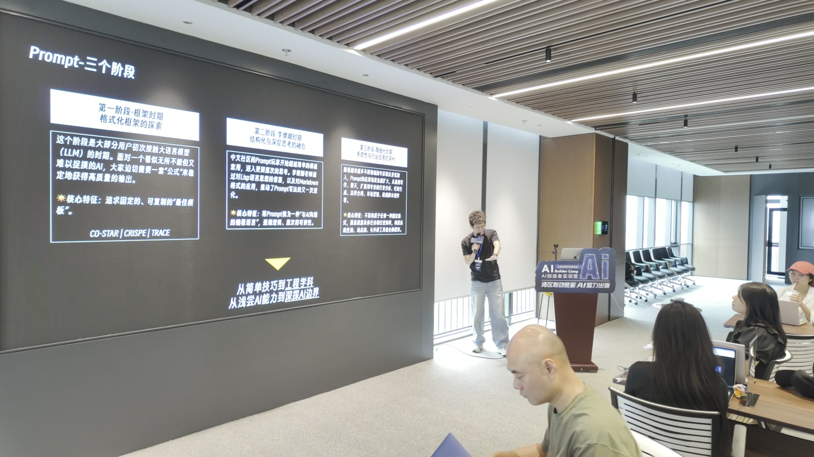

- Video：`DJI_20260830102734_0001_D`
- Time：`00:05:00.000`
- 說明：Prompt Engineering 的重點已由套模板，轉向結構化思考及行業知識。
- OCR：Prompt-三个阶段
第一阶段•框架时期
格式化框架的探索
这个阶段是大部分用户初次接啟大语言模型
（LLM）的时期。面过一个看似无所不能但又
难以捉摸的AI，大家迫切需要一畫”公式“来融
定地获得高质量的输出。
*核心特征：追求固定的、可复制的“最佳模
板”。
CO-STAR | CRISPE| TRACE
第二阶段-李媒顯时期
结构化与深层思考的融合
中文社区的Prompt玩家开始超越簡单的模板
翻用，避入更深层次的思考。幸堪顺老期道
过对Lksp语言思想的借鉴，以及於Morudown
格式的应用，推动了Prompt号族的又一次选
化.
素其の特位：WPrompt現为一W与 内酒
的缚聲语言
强源選鼻、風次和可業性。
第三阶段精密K涼E
系琼拉与行业应用纺深比
醇春慧来基多不具纸妹於李亲和从鱼都自
入，Promext的应期每最食訴扩大，及通躬写
作、聊天，扩具對专业期G业乐、假雕金
成、法第合月、本好营辑、提期更本排作
素其心部备：不真期影于任得一我服定串
式，那是提摆具你任务都行业期说，我是系
紫佳的、清本期、与外員工具維合焦。
从简单技巧到工提塑程
从浅尝A能力到深探A边是
AI创造者实训書
濟区彩动麻能 公聚出行

### LH-PE-003｜先定義六個任務變量

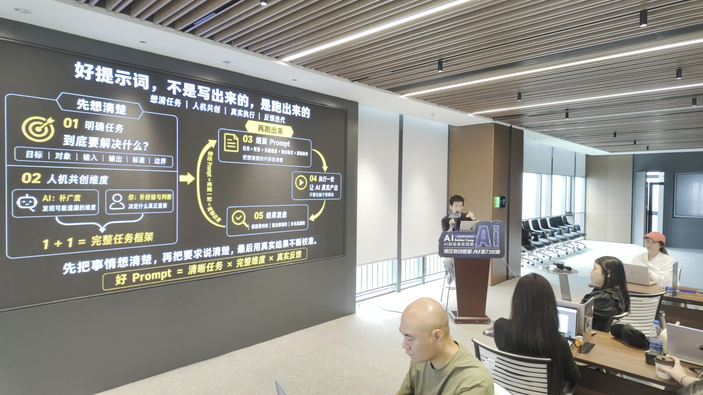

- Video：`DJI_20260830102734_0001_D`
- Time：`00:09:30.000`
- 說明：清楚的目標、對象、輸入、輸出、標準及邊界，是 Prompt 可控的前提。
- OCR：好提示词，否是是出来热。
先想清楚
不是写出来的，是跑出来的
想清任务 \人机共创| 真实执行\反馈选代
再跑出来
01 明确任务
03 组裝 Prompt
到底要解决什么？
把想清楚的内容说清楚
目标 |对象| 输入|输出|标准|边界
02
，人机共创维度
Al：补广度
发现可能遠漏的维度
你：补经验与判断
决定什么真正重要
04 执行一轮
让 AI 真实产出
不要在 子里假设
05 结果复盘
1+1=完整任务框架
保留覺财的|潛出微譜的|料克道滑的
先把事情想清楚，再把要求说清楚，暴后用真实結具不斷教源。
好 Prompt -清晰任务 x 完整維度 × 真实反傻）
A TBuderCo
AI创造者实训营
這区勝动髒能 AI聚力出海

### LH-PE-004｜先與 AI 共創問題，再要求它寫 Prompt

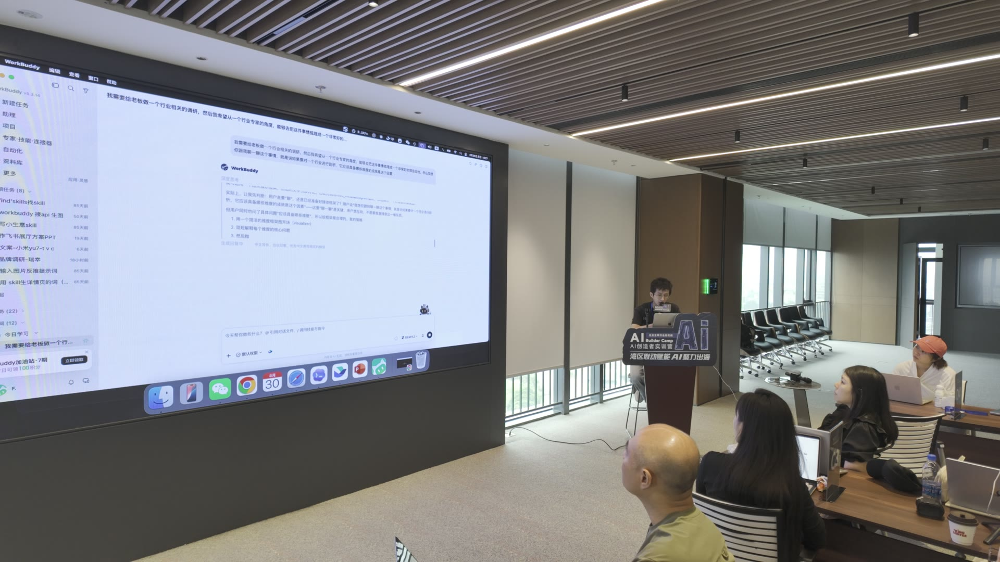

- Video：`DJI_20260830102734_0001_D`
- Time：`00:11:30.000`
- 說明：不要一開始便要求最終提示詞，先讓 AI 與你共同補全分析維度。
- OCR：kBuddy v5.3.14
新建任务
助理
项目
专茶：技能-连接器
自动化
资料库
任918）
ind'skills我skill
Duddy 撥api生圈
写小生意ski
作飞书展厅方案PPT
文案-小米yu7-tvc
品牌调研-瑞辛
输入图片反推提示词
用 skil生详情页的词（.
10天前
85天司
（22）|
a （12）
今日学
我需要给老板做一个行…
uddy加油站•7期.
白司細100航分
我需要给老板做一个行业相关的调研，然后我希望从一个行业专象的角度，能够去充这作事情或现成一个特業好的
致需要協彩板飲一个行业帽关的项号。熱后我為望以一个行金容票的高受，最陽法記文件事集供消食一个都室的等S号40，市688
容跟找第一期这个事情，放是说如原要其一个行效亮行動析、包金通其品圖经地算對原供康沒个品量
（ Worksuddy
析，它应请具备想長推度的读款能这个回着—-量“一关味，户豆司
但用户跨封也同了我伴问第“店适其藝策經海续。施以好宿的難在業的，能的去时
1.用一个請法約博度經質面升运（Vown
2.請坦新有電个牌壓的技 何量
3. 越后指
今天帮你體整什名？。引用对话文件，/時期技能与際。
30
湾区联动賦能 A！聚力出海

### LH-PE-005｜AI 補廣度，人補行業判斷

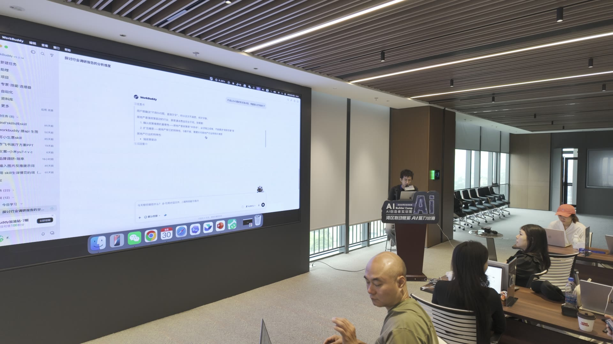

- Video：`DJI_20260830102734_0001_D`
- Time：`00:15:30.000`
- 說明：AI 擅長展開可能性，從業者負責加入真實業務判斷與優先次序。
- OCR：KBuddy ws.s.i
新建任务
助理
项日
专素•技能-连換器
自动化
资料库
更多
1任务（8）~
ind'skills我skill
vorkbuddy 按apl生图
写小生應skill
书展厅方案PpT
文案-小米yU7-tVC
品牌调研-瑞华
南入图片反推提示词
用 ski/生详情页的词（...
採讨行业调研报告的分析维度
控用•黄州
45天能
85页附
@ Worknuddy
用户期确这“不用SVG團，真接文字。所以这没不画凯，试文习机
网地門開强没M吸边的行业，温質通消豐品究食不司。休需美
1. 确认改第惟度的費性一明地户里政策理“準条会”必欢性应成性，不能基過“勞文量
之扩兒博度…舅地产有它的特钱性，今性不错，我最什时实他們行受特我打裡的
舅地产行业的料摸性
•媛政策塑动
4（22）
3 （12）
今日学习
探讨行业调研报告的分.
Jddy加油站-7期
日可领100职分
令天關你𠿭輕什次少癥引用討团父件，/𨭬期拮談擊脂
十◎ 默授眾：
30
湾区联动赋能 A/聚力出海

### LH-PE-006｜同一研究框架必須按行業改變權重

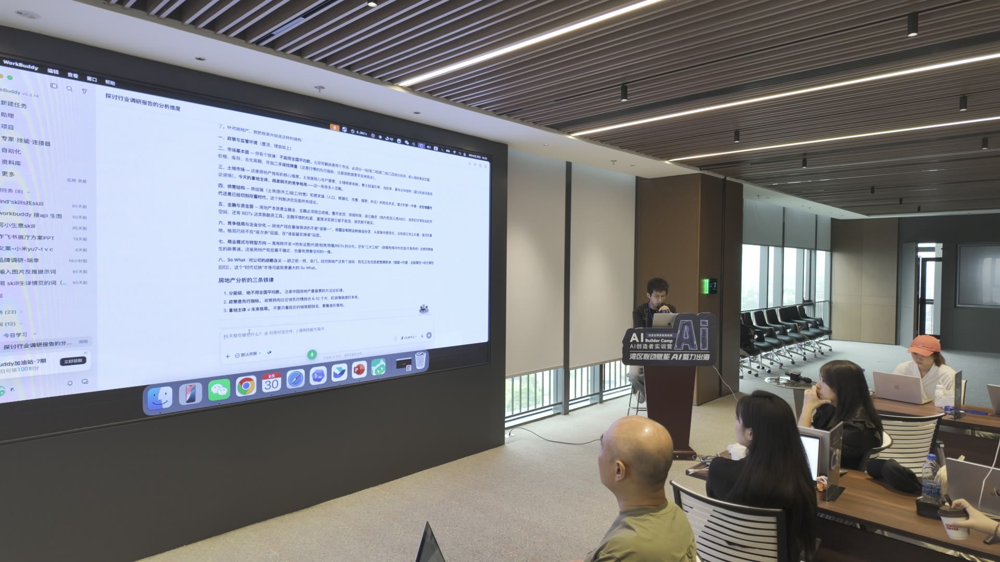

- Video：`DJI_20260830102734_0001_D`
- Time：`00:16:30.000`
- 說明：通用分析維度不能平均套用，行業差異會改變資料來源和章節優先級。
- OCR：新建任务
环讨行业调妍报眚的分祈缏廛
眾：技能•连接額
目动化
nd'SKilIS:XSKill
vorkbuddy 搜api生比
可小生煎skil
飞书展厅方案PPT
米VU7-tVC
3牌调研-瑞率
50米雪
19%點
地时們地/。教肥粗第升频羅這样的陽料
一改出与监食牙壞（豐讀，理由路上
二，市场基本面一位有个钱律：不能用全国平均数，乳联取的成提翼个市場，必置分一钱随二核階二以后這線分著研。剪（有好專做又
价格、库存、去化闲期，外加二手保推燒餐（这具行情的先行标，比並腐醇襄要后造
三、土地市场一这基房地产经有的核心维屋，
土地鹽版心全户麥難，全健視星會鞋，輕生拉滿令家，我花家，拿地美快传料當2件能是是
全进场）。今大的寫地主体，該股明天的負多格開—-这一条租多人想都
四供量结构一供恰望（土側/开工（工附售）能赏杂注（八口、被银化、改善、培算。拆进）的没含美果。整传为的。件事：然者地
代还速已经奶製存量的代。这个轉新决定后套納有結论
五、金期与员金肉一舅地产本渍是含融数，全融必須物定烧線，義并发燒，接落杉家、南公转費（9内使/元楼085，萬與E料業製的
空间，还有 REITs这员新數疫工具，全額纤續的松花，直據净定與公装不範為，鼠肌败不能異
六，我多格局与企业分化一房地們段在坚债得讲的不麼“改见一”，继啵全把驱公的命這份见，头都保中警要化。出取我之怎公们置，我是在的
地。格局已級不在“座次表“腐醒，在*這談留在牌你，品费，
七商业模式5转型方向一高黑传开发•持有這餐代達起钱指餐REiTs的分化。还有“三大工程：（留健免战中村改通洋急美南2地建
生的新赛逝，这基魔地产最在蟲不情定，也顧有想象空间的一播。
八So What•对公们的战路食义一經之前一样，命门，你计实地产連有个比标，輕隆是好行馬食性转系告（建道4行你，士新翼学。是你地
cki|牛详情訓的區《.
窝他衣分折的二帑轶律
1. 分欲袋，携不用全四事均数，这星中四实地户最重更的方法论紀樓。
？ 改開限先行招标。設陪转向拉挂转完打情找合心的个拜，打边望就都打来。，
3. 拿地主体：未来精局。不要只看现存的销信都健名，美数遭存拿地
操讨行业调研报街的分…
iddv加油站•7期
日前5100.分
30
Al创适者实训营
湾区朕动盤能AA/聚力出海

### LH-PE-007｜觀察 Agent 的執行過程

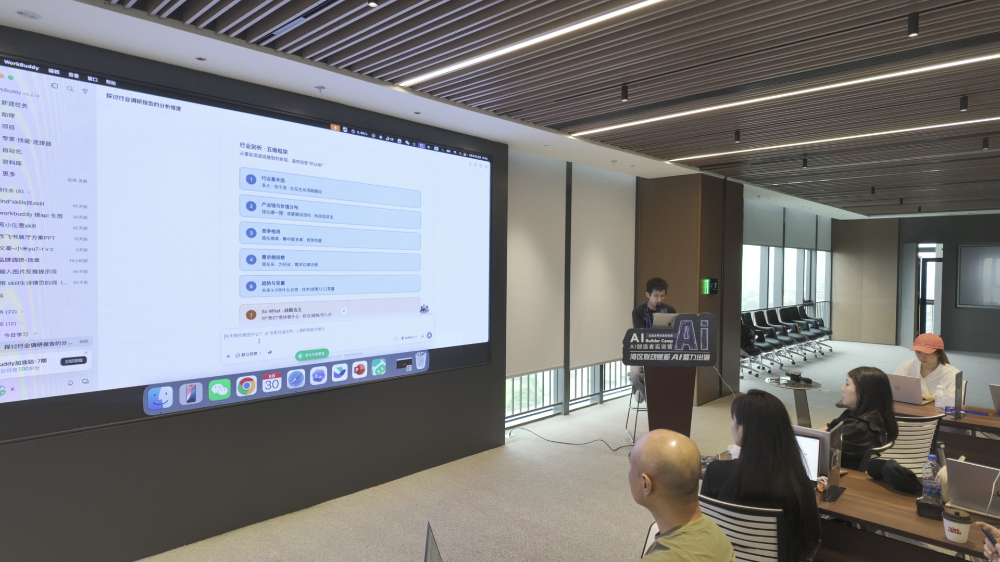

- Video：`DJI_20260830102734_0001_D`
- Time：`00:14:00.000`
- 說明：不要只等最終答案；觀察工具選擇及中間步驟，才能知道偏差在哪裡發生。
- OCR：新建任劳
潔•技能•连拔公
目动化
炎料靠
indSkillstevil
vorkbuddy 按api 生間
SASG TSKIll
书展厅方案PP！
文案-小米yu7-tvc
10実前
渝大國片反推提元商
国skil牛详情可的面（
今日学习
採讨行业调研报告的分…
uddv加油味•7期
日前价100米外
行业创析•五憔維梁
从事实脂理级推對封斷關，最终器有*条以電
行业基本通
次，磨不爆，雙在定魯簡關觀！
丝在惠一路，總單握话造稅，制踐地算差
進在牌虞：集中度多腐，雙勿對會
肭热与寜量
未岸3-5鍾什么發安。技水/店/人口克
So What，战野含。
對16"取請着什会：税会限約所入合
今天帮你體經忏久7每引用珍请史件，/調與樓榮專脂：
30

### LH-PE-008｜用另一個細分類測試通用性

- Video：`DJI_20260830102734_0001_D`
- Time：`00:20:00.000`
- 說明：Prompt 在原案例成功，不等於已經可重用；必須換一個相近但不同的案例驗證。
- OCR：worbuday.
© 新達任
◎项日
初专潔：技流 连接器
C自动化
CD 窗料路
＃行业別折，通用分析福架提示调＞粑一个行显的“否放親影“呀清慧，让决然名看突喬真接給看，见
在开论美研前，我向丽户明以其价事，提业没定备健更就我道与3Q
…这份我合服男于什么承期？。
，进入/發舞这个行业。盟说 P业保料助分考。指男父量，是入型位
，加別放入/注點沒盟•產址：期多馬期。需家造努。日9合里
省頂任务18）
7-find'skills控sk
3-woekbuddy 投api生團
7-写小生應skm
制作 书限 方案PPT
2-文 -小米yU7-IVC
1-品牌调研-瑞空
（ workBuday
行业剖折•电饭煲行业
任外（23）
2间 （1）
今日学习
白uddy加油贴-7期
30
。•
Al
Builder Cam
AI创造者实训营
Ai
湾区联动財能 A/聚力出海

## Context 與 Prompt 排錯

### LH-CTX-001｜Context Window 是有限工作記憶

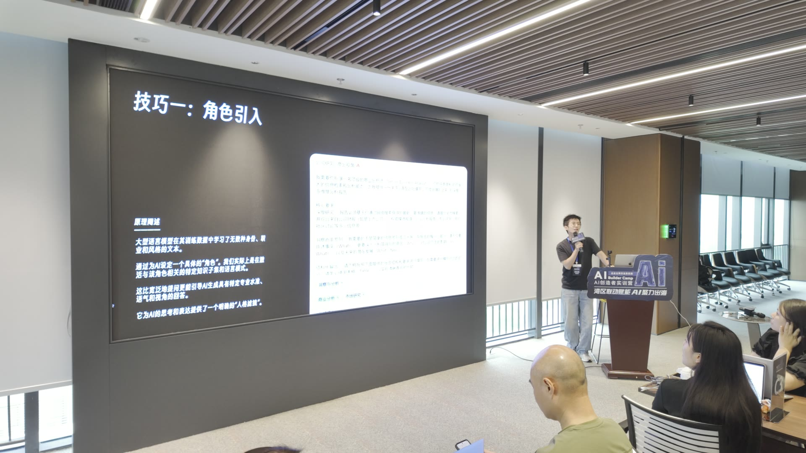

- Video：`DJI_20260830102734_0001_D`
- Time：`00:24:30.000`
- 說明：同一窗口承載的歷史越多，可供當前任務使用的有效空間便越少。
- OCR：技巧一：角色引入
原理周述
大型语言模型在其训练最据中学习了无數种身份、取
业和风格的文本。
通过为AI设定一个具体的“創色。我们其际上是在激
活与该角色相关的特定知识子巢和语宫模式。
这此建泛地提间更能引导A生成具有特定专业水准、
這气和视角的回含。
它为A的思考和麦达提供了一个明前的“人将遊统”
ALeonecrca
AI创造者实训童
湾区联动赋能 A/聚力出海

### LH-CTX-002｜自動壓縮可能犧牲細節

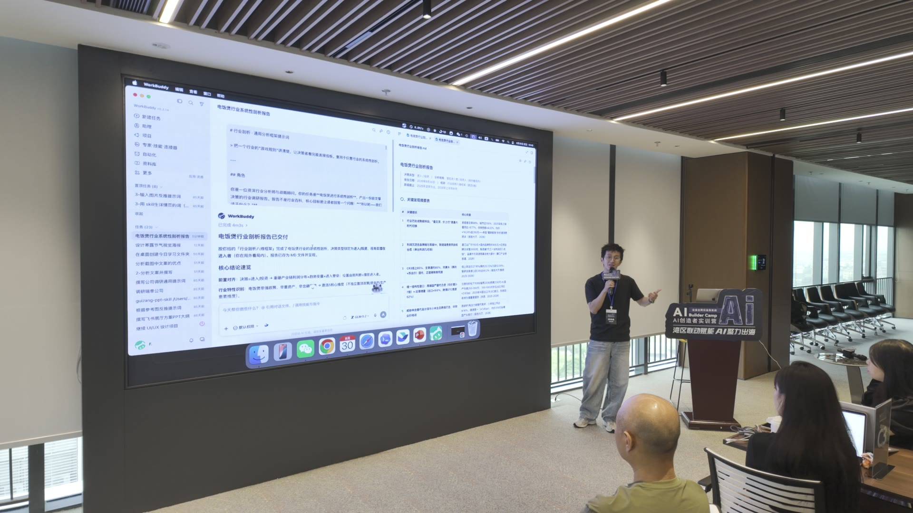

- Video：`DJI_20260830105517_0002_D`
- Time：`00:01:00.000`
- 說明：系統為延續長對話而壓縮歷史時，細節、例外和先後關係可能被弱化。
- OCR：© 新建任步
4 项日
专淑•技能•连搜料
女自动化
97 空料路
23更恩
頭任路（8）
3-1入西片受推银示国
3-用 aki生洋備页的海 大
电饭煲行业系坎性剧析报會
设计寒靄节气视觉海报
在率丽创建今日学习文件央60对
分析截图中文案的优点
2-分析文帮井撰写
撰写公司调研通用擤示饲
俩研璘睾公司
guizano-ppt-skal /sers/-
根镢杪考圈反推擤示词
預写飞书展厅方案PPT大級
烧续 UVUX 设计项日
电饭煲行业系魄性刳听报皆
，行业别析。通用分析粗外提示酒
＞把一个行金的“請难规創“沸清丝。让决條最糖完浓真接治板。复用于任意時食的系晚特的系。
你别一位费深行业分听经与放数特们。你的任务亂。电呀候进行系烧特的有“，們出一好給要没
决策的行业測研报售。税会不是行数各料，税0日縣是让度 国第一个付理：…味 一行
1 workBuddy
已発成 4m3s.3
电饭煲行业剖折报告已交付
按察協的「行业別析八物權架，完成了电饭便行业的承饮忙弱析，决飄发型锐還力現入股寶。没和而那在
进入者（你在局外着局内）。报传已存为 MD 文件并呈模。
核心结论速览
的盟对疼：决第。进入股列。重頭产金销制附分布。對助安翻。更入雙受：位着過我判重。關在清入者。
多天帮你霞些什么？爱引附对语文样。/离市技路与路Q
•C
电饭煲行业副斩璐告
◎.关罐发现纳要悉
A LBoidoec
AI创造者卖训旁
湾区联动赋能 AI聚力出海

### LH-CTX-003｜新窗口是隔離實驗環境

- Video：`DJI_20260830102734_0001_D`
- Time：`00:20:00.000`
- 說明：測試 Prompt 時要在乾淨窗口執行，避免舊對話暗中提供答案。
- OCR：worbuday.
© 新達任
◎项日
初专潔：技流 连接器
C自动化
CD 窗料路
＃行业別折，通用分析福架提示调＞粑一个行显的“否放親影“呀清慧，让决然名看突喬真接給看，见
在开论美研前，我向丽户明以其价事，提业没定备健更就我道与3Q
…这份我合服男于什么承期？。
，进入/發舞这个行业。盟说 P业保料助分考。指男父量，是入型位
，加別放入/注點沒盟•產址：期多馬期。需家造努。日9合里
省頂任务18）
7-find'skills控sk
3-woekbuddy 投api生團
7-写小生應skm
制作 书限 方案PPT
2-文 -小米yU7-IVC
1-品牌调研-瑞空
（ workBuday
行业剖折•电饭煲行业
任外（23）
2间 （1）
今日学习
白uddy加油贴-7期
30
。•
Al
Builder Cam
AI创造者实训营
Ai
湾区联动財能 A/聚力出海

### LH-CTX-004｜複雜任務要按成果切分

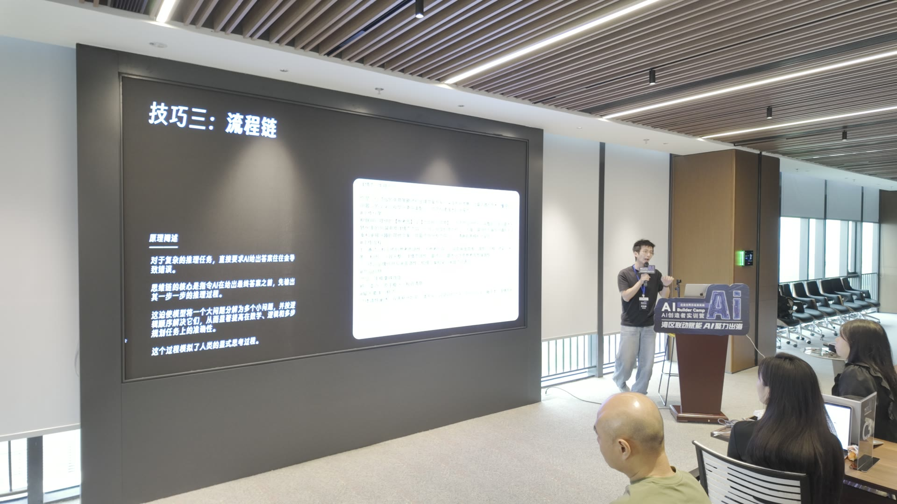

- Video：`DJI_20260830102734_0001_D`
- Time：`00:25:51.000`
- 說明：切分任務的單位應是可驗收成果，而不是任意把長文字分成幾段。
- OCR：技巧三：流程链
原堙阉逑
对于無杂的推理任务，直换更泉A给出答素往住会号
致错误。
思维鍾的模心是指令A在給出最終答案之前，先都出
其一步一步的推理过握。
單順序解决它们，从而显著提高在最学。
規創任务上的准确性。
这个过裡模拟了人类的显式思考过想。
AI创造者实训道
湾区联动赋能 AJ聚力出海

### LH-CTX-005｜結構化格式減少理解歧義

- Video：`DJI_20260830105517_0002_D`
- Time：`00:04:00.000`
- 說明：標題、欄位、清單和輸出格式能把自然語言要求轉成較穩定的操作規格。
- OCR：◎ 新建任
司 雙凍：预織•逢接器
©自动化
QD 空料路
富：任舞（8）
3-输入阳片受推摄尔码
3-用 ki生洋情页的限（0088
双配
电饭煲特业系统性創忻维會E
在卓丽创建今日学习文件央 10天时
分析截图中文富的优点
2-分折文案井撰写
撰写公司调研通用提示细
调研瑞萃公司
guizang-ppt-skill /usersf
旗写飞书服厅方業PPT大路
电饭煲行业系媲性剔听报告
典行业剧析。通用分析粗架摄示网
》把一个行业的“為效辣到“讲清丝，让决集和看完源真接治物。重用于任雙行血的不供精的乐，
你差一位的深行业分听经写数总精问。你的任务基“需派集過行系供特部有”F出一包新交味
workBuddy
已完段 4m3s3
电饭煲行业剖折报告已交付
按你给的「行业劍析八婚模架」完成了电饭煲行业的系妳性剑听，决開算型锐定为追入股翼，报物取都在
进入者（你在局外着局传）。报告已存为 MD 文件井全规。
核心结论速览
的置对齐：决閒=连入N產•建罐产业销制到分布。扫外食翻。进入型參：位置由穀判新。精在进人者，
更燉维度）
今天帮你附技什么？净引附对暖文件。/请用技的与期。
•C
电饭煲行业副斩报告
◎.关罐发销要表
#com
AI创造者实训中
鳳司
湾区联动赋能 AI聚力出海

### LH-CTX-006｜Prompt 四層排錯

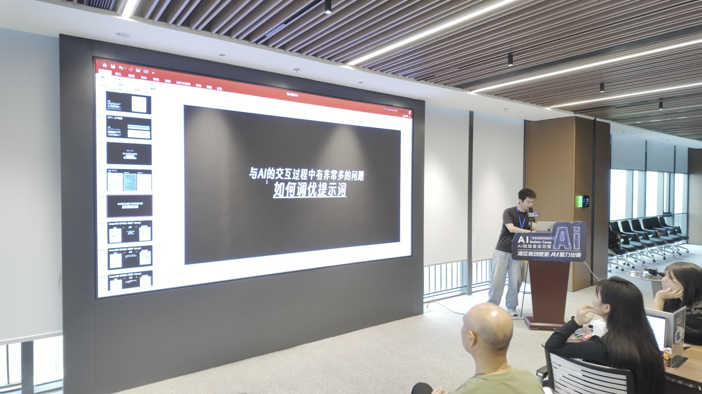

- Video：`DJI_20260830105517_0002_D`
- Time：`00:04:15.000`
- 說明：答非所問時，依序檢查目標、流程、格式及背景資料，不要只叫模型「再做好一點」。
- OCR：与AI的交互过中有非常多的问题
＃如何猖优提示迿
4I创造者实训：
湾区联动赋能 A/聚力出海

### LH-CTX-007｜重置 Context 前先留下交接摘要

- Video：`DJI_20260830105517_0002_D`
- Time：`00:01:00.000`
- 說明：開新窗口不是把一切忘掉，而是只帶走已確認的目標、資料、決定和未完成項。
- OCR：© 新建任步
4 项日
专淑•技能•连搜料
女自动化
97 空料路
23更恩
頭任路（8）
3-1入西片受推银示国
3-用 aki生洋備页的海 大
电饭煲行业系坎性剧析报會
设计寒靄节气视觉海报
在率丽创建今日学习文件央60对
分析截图中文案的优点
2-分析文帮井撰写
撰写公司调研通用擤示饲
俩研璘睾公司
guizano-ppt-skal /sers/-
根镢杪考圈反推擤示词
預写飞书展厅方案PPT大級
烧续 UVUX 设计项日
电饭煲行业系魄性刳听报皆
，行业别析。通用分析粗外提示酒
＞把一个行金的“請难规創“沸清丝。让决條最糖完浓真接治板。复用于任意時食的系晚特的系。
你别一位费深行业分听经与放数特们。你的任务亂。电呀候进行系烧特的有“，們出一好給要没
决策的行业測研报售。税会不是行数各料，税0日縣是让度 国第一个付理：…味 一行
1 workBuddy
已発成 4m3s.3
电饭煲行业剖折报告已交付
按察協的「行业別析八物權架，完成了电饭便行业的承饮忙弱析，决飄发型锐還力現入股寶。没和而那在
进入者（你在局外着局内）。报传已存为 MD 文件并呈模。
核心结论速览
的盟对疼：决第。进入股列。重頭产金销制附分布。對助安翻。更入雙受：位着過我判重。關在清入者。
多天帮你霞些什么？爱引附对语文样。/离市技路与路Q
•C
电饭煲行业副斩璐告
◎.关罐发现纳要悉
A LBoidoec
AI创造者卖训旁
湾区联动赋能 AI聚力出海

### LH-CTX-008｜先分辨 Prompt 問題與系統問題

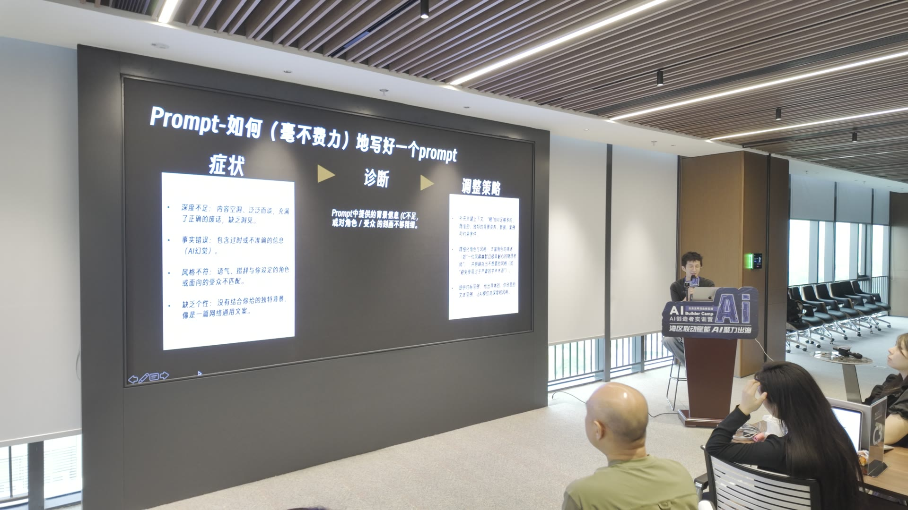

- Video：`DJI_20260830105517_0002_D`
- Time：`00:06:00.000`
- 說明：輸出失敗不一定是 Prompt 寫得差，也可能是資料、工具、能力或 Context 不足。
- OCR：Prompt-如何（毫不费力）地写好一个prompt
症状
诊断
Prompt中提供的責最售惠（C不足，
或对角色/曼众的刻面不多箱匀。
•
深度不足：内容空洞、泛泛而谈，充满
了正确的废话，缺乏润见。
• 事实错误：包含过时或不准确的信息
（AI幻觉）。
• 风格不符：语气、措辞与你设定的角色
或面向的受众不匹配。
• 缺乏个性：没有结合你始的独特背腰，
像是一篇网络通用文案。
调整策酪
小所关梁上下X“师“狼利足嘛多的
羅佳說，拉特的肯着2月.能美。翠9
#死园慈出不想要的只将近
w煲使用过于严具約孕米料裹"
Al创造者实训
湾区联动賦能 A/聚力出海

## Skill 搜尋、建立與架構

### LH-SKL-001｜Skill 是可重用工作方法

- Video：`DJI_20260830105517_0002_D`
- Time：`00:08:00.000`
- 說明：Skill 的價值不是多一個指令，而是讓已驗證的方法可以被穩定再次使用。
- OCR：心 1日
§-饭入图片之推增平。
攒写公司调枅通用摟示；
根返杪发團及推擤示调
Skil 是 进阶的提示词，一个文件夹
AI创造者实训店
湾区联动赋能AI聚力出海

### LH-SKL-002｜主規則與參考資源要分開

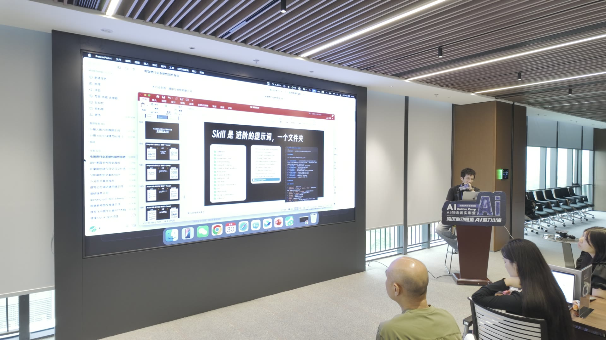

- Video：`DJI_20260830105517_0002_D`
- Time：`00:08:00.000`
- 說明：核心指令只保留路由和硬規則，詳細知識、範例及工具應按責任拆開。
- OCR：心 1日
§-饭入图片之推增平。
攒写公司调枅通用摟示；
根返杪发團及推擤示调
Skil 是 进阶的提示词，一个文件夹
AI创造者实训店
湾区联动赋能AI聚力出海

### LH-SKL-003｜先搜尋，再決定改造或自建

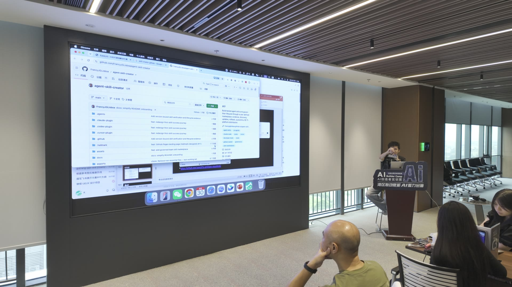

- Video：`DJI_20260830105517_0002_D`
- Time：`00:12:30.000`
- 說明：建立 Skill 前應先確認是否已有可借鑑方案，避免重複發明。
- OCR：FtancyJGLisboa / agent-skil-creator •
agent-skill-creator 公月
1分 020路
FrancyJGLisboa docs: simplty README onbosrdng
Q w1文付
claude-plugin
codex-plugin
cutsot-oloir
.github
feat: tedevign fiest-skn success joune
根摡鈔者闟反推綴示翊
演写7书限厅方案PPT大路
A I BulderCd
AI创造者实训营
四司
湾区联动赋能 AA/聚力出海

### LH-SKL-004｜Star 和下載量只是訊號

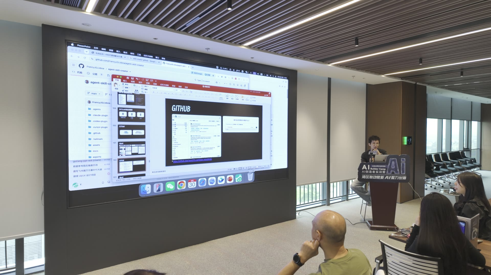

- Video：`DJI_20260830105517_0002_D`
- Time：`00:12:45.000`
- 說明：流行度能協助排序候選，但不能證明它符合你的工作或可以安全使用。
- OCR：agent-skill-cr
main
GITHUB
gulzang-ppt-ski JUsers/
椴踞鈔考圈反推镘示冊
写飞书展厅方案PPT大
健撑 U/UX 设钟项司
30
AlBmee
AT创造者实训鉴
湾区联动財能 A/聚力出海

### LH-SKL-005｜安裝前要讀懂它會做甚麼

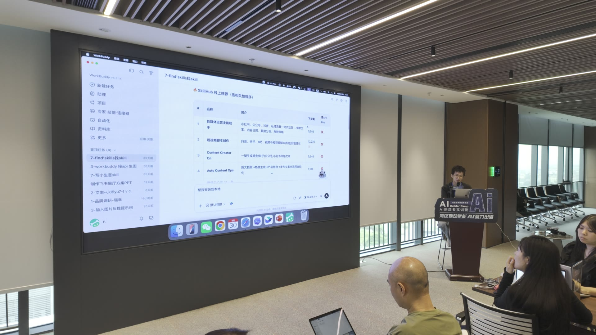

- Video：`DJI_20260830105517_0002_D`
- Time：`00:17:00.000`
- 說明：候選 Skill 必須先核對觸發、輸入輸出、外部依賴及可能變更，再進入使用。
- OCR：WorkBuddy.vB.3.14
④ 新建任务
助理
专案：技能，连接器
◎ 自动化
Q 资料库
8更多
置頂任勞（8）～
7-find'skills找skill
3-workbuddy 接api生團
7-写小生意skill
制作飞书展厅方案PPT
2-文案-小米yu7-tvC
1-品牌调研-瑞幸
3-输入图片反推提示词
7-find'skills投skill
森用-更醋
SkillHub 线上推荐（按相关性排序）
#名務
自媒体运营全能助
2 短视频脚本创作
Content Creator
商介
小红节、公众号、料音、私城流量一站式酒营-爆敬文
案、内容日历、致强分析、涨粉策路
料音、快手、B站，視频号短模烘製本/（题/特套建议
一健生成鋸金/知乎/公众号小红书风格文章
热文抓取 热梗生成＋产品结含 发布文富金程自动
85天前
50-
10天前
6天前
10小附前
85天煎
4 Auto content Op：
帮我安装到本地
+◎默认取限*
30
下錯量
12.235
5.346
RAD
AlBondere
Al创造者实训些
湾区联动赋能 A1聚力出海

### LH-SKL-006｜只沉澱已跑通的成功方法

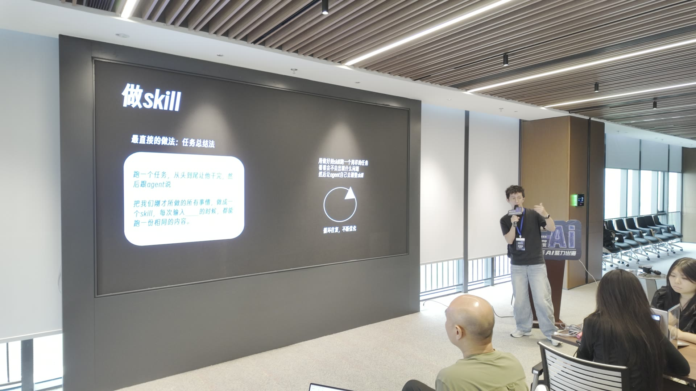

- Video：`DJI_20260830105517_0002_D`
- Time：`00:22:00.000`
- 說明：不要把尚未驗證的 Prompt 和錯誤流程封裝成可重用 Skill。
- OCR：做skill
最直接的做法：任务总结法
跑一个任务，从头到尾让他干完，然
后跟agent说
把我们刚才所做的所有事情，做成一
个skill，每次输入
的时候，都能
跑一份相同的内容。
量会不会出現什么同着
然后iogent自己去量si
看环往复，不断做化
¥AI聚力出海

### LH-SKL-007｜Skill Creator 的難點是思考

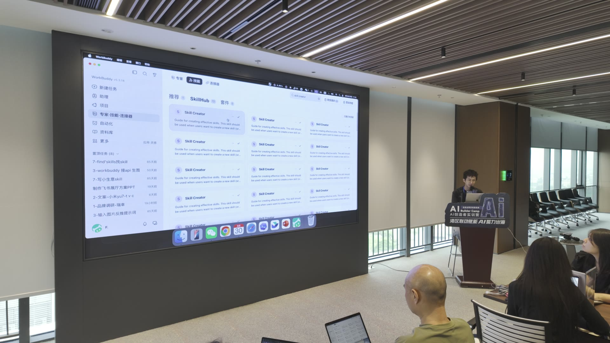

- Video：`DJI_20260830105517_0002_D`
- Time：`00:25:51.500`
- 說明：建立檔案並不難，真正困難是把隱性經驗說清楚並消除矛盾。
- OCR：WorkBuddy v5.3.14
© 新建任务
助理
• 项目
0 专象•技能•连接器
◎ 自动化
Q 资料库
82 更多
置顶任劳（8）~
7-find'skills找skill|
3-workbuddy 接apl 生圈
7-写小生意skill
制作飞书展厅方案PPT
2-文案-小米yu7-tVC
1-品牌调研-瑞素
3-输入图片反推提示词
F.
皮用：灵路
85天前
19天前
6天的
85天府.
包专案
》技能
◎ 连接器
推荐。
SkillHub
套件⑥
Skill Creator
Guide for ceeating effective skis, This skin shosld
be used when uzers want to creste a new skil （ok.
Skill Creator
Guide for creating effective skills This skilt should
be used when urers want to create a new skill （or.
Skill Creator
Guide for creatieg effecee skls This skis sod
be ures wen wats ozne to creesrex ch ser
Skill Creator
Skill Creator
Guide for Creating effective skils This skl shound
be used when users want to create a new skil （on
SkillCreator
Skill Creator
Guide for creating oftective skilk Thi skll shouls
be used whien users Want fo creste.a new ski （on
30
Sol Creatos
SSulCreso
S Skill Creator
S Ski Creator
AI创造著实训尝
湾区联动赋能 A/聚力出海

### LH-SKL-008｜頂層設計先於規則堆疊

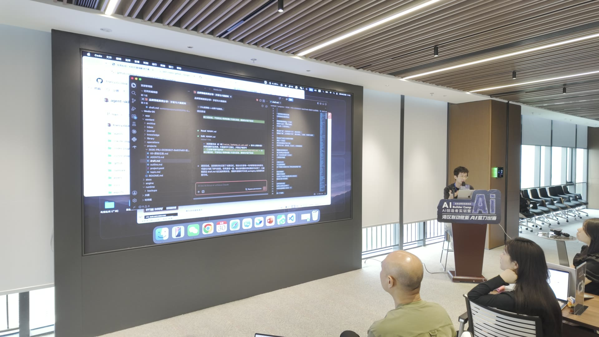

- Video：`DJI_20260830112259_0003_D`
- Time：`00:04:00.000`
- 說明：當多個用途混在同一 Skill，應先重畫意圖和路由，不要繼續添加更多規則。
- OCR：+D
D
30
Aleu遭若安训器
湾区联动赋能 AI聚门出海

## 個人 AI 工作台

### LH-WB-001｜工作台不是工具清單

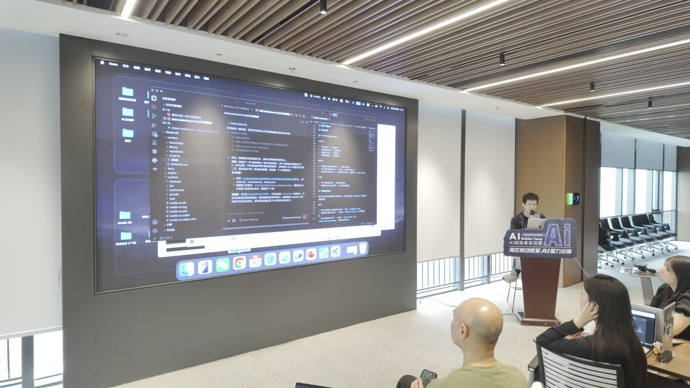

- Video：`DJI_20260830112259_0003_D`
- Time：`00:10:00.000`
- 說明：個人 AI 工作台應圍繞完整工作鏈設計，而不是把常用 AI 網站放在一起。
- OCR：G
u
30
AI创造著实训
凤冒
湾区朕动赋能 A/聚力出海

### LH-WB-002｜資訊層只收真正需要的訊號

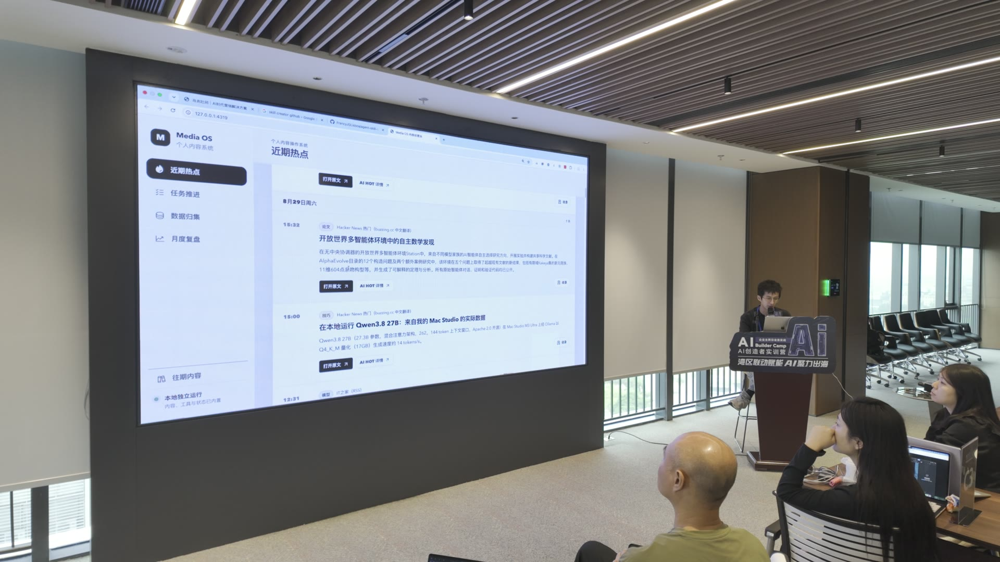

- Video：`DJI_20260830112259_0003_D`
- Time：`00:09:15.000`
- 說明：工作台的情報入口要減少噪音，聚焦與角色及業務有關的來源。
- OCR：127.0.0.1:4319
M
Media Os
个人内容系统
近期热点
三 任务推进
数据归業
月度复盘
个人内假總作系線
近期热点
打升取文元
AI HOT 棠情
8月29日周六
15:32
Mackne News M（burpna cc中交額量）
开放世界多智能体环境中的自主数学发现
在无中央协调赛的开放世界多智能体环，Staton中，来自不周模型就族的A智都体自生源往研究方向，开M要验岸粉请共拿料学文就。在
AlphaEvole目录的12个构遗问點及两个额外案例研究中，读环境在五个问選上取带了总路取有文射的訴造量包括有園堂6ug，室約原法对性，
11维604点泉吻构型零，并生成了可解釋的定现与分析。所有源始習能体对话，证明和给证代县均己公开。
打并原文
AINOT 详情3
Hacker News B/（bannocc 中公部动）
在本地运行 Qwen3.8 27B：来自我的Mac Studio 的实际数据
Qwon3.8 278 （27.38 参效，混合注意力解物。262,14410kon 上下次 口。Apac 20升建） 在Mi:S0d0 M3 U80 LR Oiecat
Q4_K M盟化（17GB）生战速度約14 tokensis。
打开源文
AI NOT I+ ×
往期内容
• 本地独立运行
内容.
工段与状道已内置
12:31
AI创造者实训觉
湾区联动賦能 A/聚门出海

### LH-WB-003｜生產層要固定內容由靈感到交付的路線

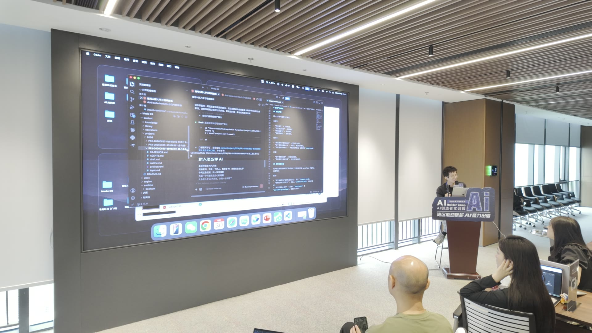

- Video：`DJI_20260830112259_0003_D`
- Time：`00:11:00.000`
- 說明：選題、寫作、排版及發佈準備應是一條有狀態的生產線。
- OCR：toas os
新人怎么字 AI
30
AI创造者实训堂
则冒
湾区联动赋能 AI聚力出海

### LH-WB-004｜數據層把多平台結果拉回同一視角

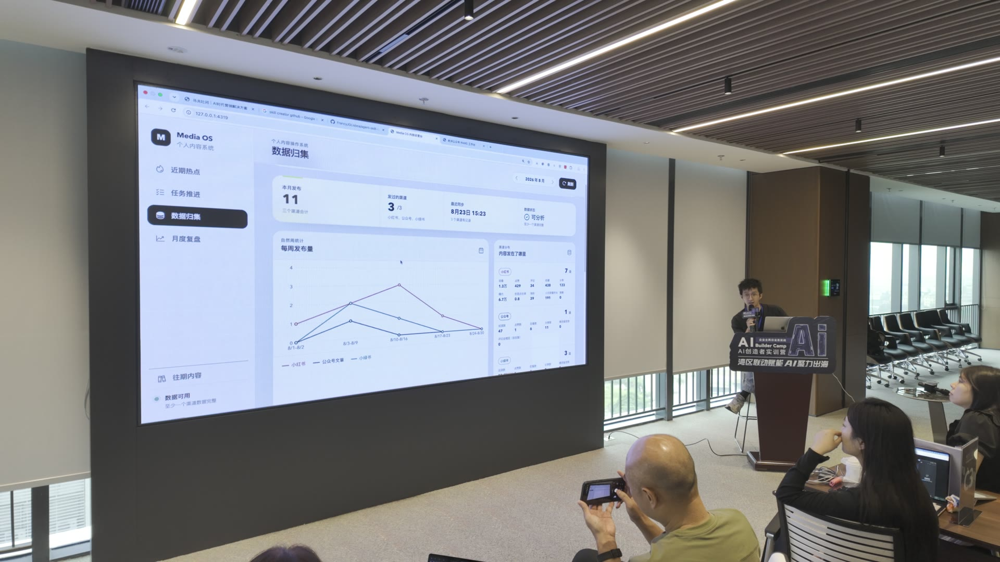

- Video：`DJI_20260830112259_0003_D`
- Time：`00:13:30.000`
- 說明：發佈後的數據要集中比較，否則內容生產與結果之間沒有閉環。
- OCR：127.0.0.1:4319
M
Media OS
个人内容系统
◎
近期热点
三 任务推进
效据归集
区 月度复盘
全人內容福作蒸劑
数据归集
本月发布
11
自然厢皖计
每周发布量
公众号文學
往期内容
数据可用
茶少
个置遺數謝究聲
31
公节。公众号。小想油
最元間$
8月23日15:23
1个棗道報2量
◎ 可分析
AI创遗者实训堂
见冒
湾区联动赋能 AI聚力出海

### LH-WB-005｜數據要配合歷史和分布閱讀

- Video：`DJI_20260830112259_0003_D`
- Time：`00:14:00.000`
- 說明：單看總閱讀量不足以判斷內容，還要比較發佈量、中位數及歷史變化。
- OCR：巧克灶銷」科封代煲镇躺澳为寓×
127.0.0.1:431
M
Media Os
个人内容系统
近期热点
任务推进
数据归集
月度复盘
人冉銈擤怍系螅
数据归集
本月发布
20
三个業通合汁
白然用規汁
每周发布量
公众号文
往期内容
数据可用
个潮還數擺完靡
发过的罩滩
33
暑近向少
8月23日15:23
30.1万
◎ 可分析
AI创造者实训
鳳骨
湾区联动财能 A/聚力出海

### LH-WB-006｜用內容象限找可複製的好內容

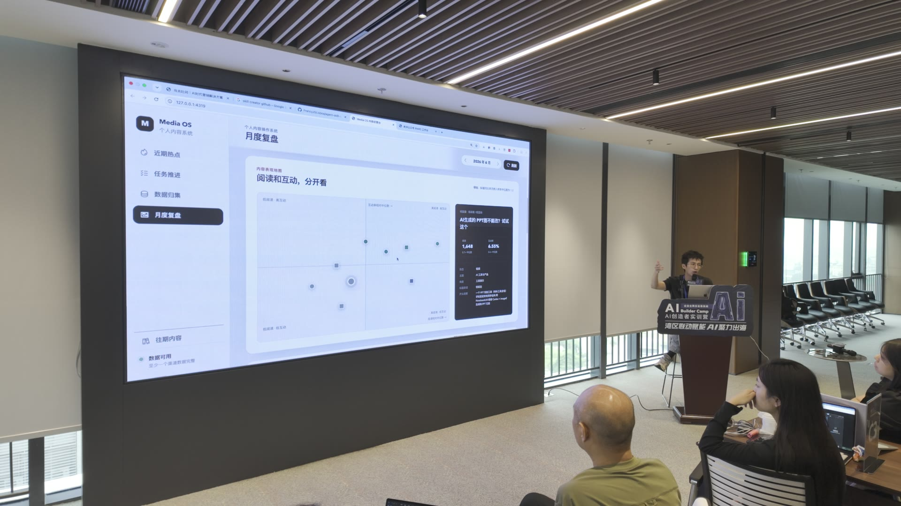

- Video：`DJI_20260830112259_0003_D`
- Time：`00:14:45.000`
- 說明：把互動與點擊等不同目標拆開，可以找出雙指標都強的內容。
- OCR：27.0.0.1:4319
M
Media Os
个人内容系统
近期热点
三 任务推进
@
数据归集
月度复盘
全人肉戰轠怍系號
月度复盘
内容羲现地問
阅读和互动，分开看
往期内容
数据可用
个潮道數貂完量
AI生成的 PPT图不能改？试试
这个
ions
csk
AI创造者实训劃
湾区联动賦能 AI聚力出海

### LH-WB-007｜復盤必須解釋好與差的原因

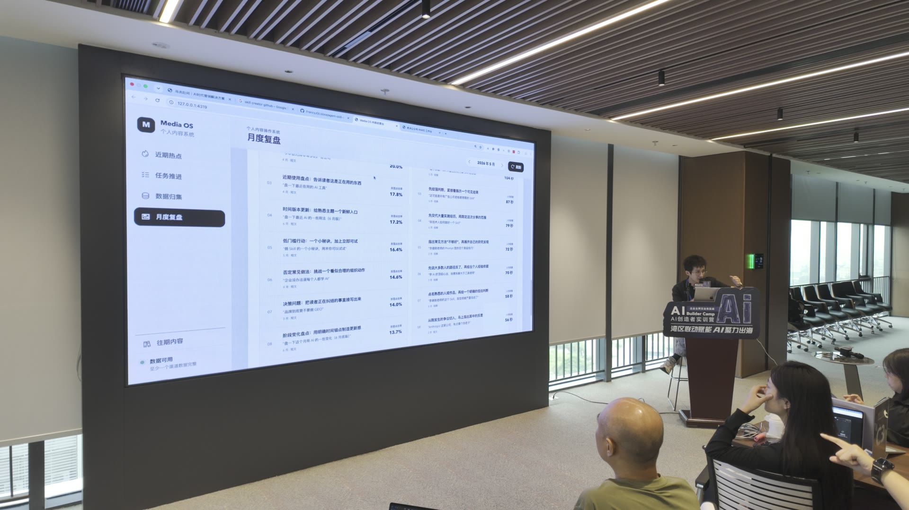

- Video：`DJI_20260830112259_0003_D`
- Time：`00:15:30.000`
- 說明：工作台不能停在數據展示；真正價值是把結果轉成下一輪規則。
- OCR：127.0.0.1:4319
Media Os
个人内容系统
近期热点
E 任务推进
@
数据归集
月度复盘
个人内宿換作系說
月度复盘
近期使用盘点：告诉读者这费正在用的东西
：食一下经近在用的A工月！
时间版本更新：给熟思主選一个新鲜入口
低门惱行动：一个小秘诀，加上立即可试
香定常见做法：携战一个看似含理的组织动作
决策问聽：把读者正在纠烟的事直接写出来
•品第別展員不業錢GEO'
於段变化會点：用明確时间都点新透更蒙維
含一下这个月相A的一盐受化（0MEW）-
往期内容
• 数選可用
萃少
个棗遴數蹤究靡
20.0%
17.8%
17.2%
16.4%
14.6%
14.0%
完埝活料新。富根雖服系一个对见住没
克交代大量实涮堤历，再难定这次分事的等3
翔出菜见方温“不够好，再城开们已的哥兒以眼
免说大多数人的時惺受了。再始出个人提给德理
众名群里的人理作品，那给一个对讲粉保包生面
从规发全於身代绍入，月上指出其伊的乐置
790
728
$8½
AI创造者实训觉
湾区朕动賦能 AI聚力出海

### LH-WB-008｜高價值人才加工作台才形成降本增效

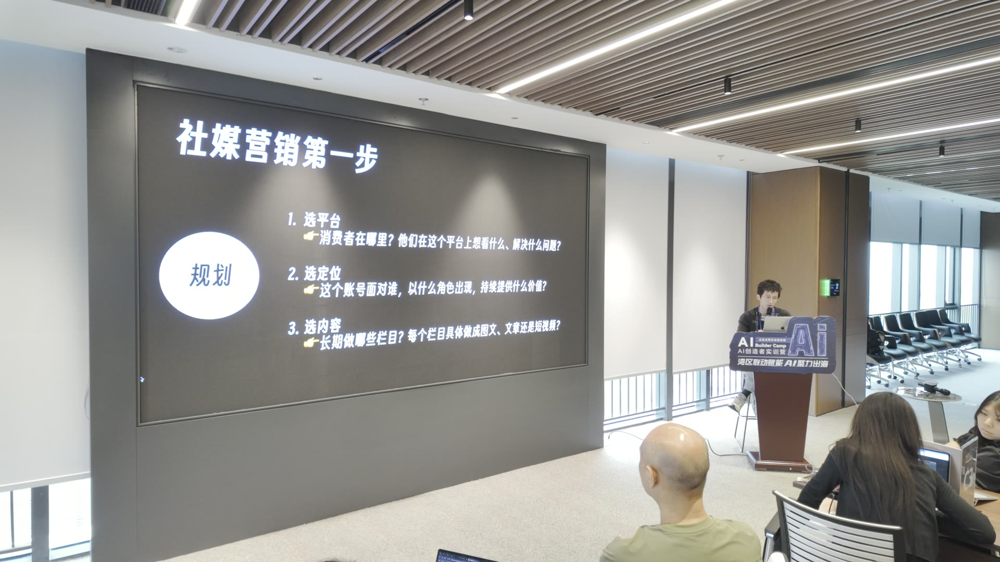

- Video：`DJI_20260830112259_0003_D`
- Time：`00:17:20.000`
- 說明：企業效率來自懂業務的人把 AI 做成系統，不是單純採購更多工具。
- OCR：社媒营销第一步
规划
1. 选平台
（消费者在哪里？他们在这个平台上想看什么、解决什么问题？
2. 选定位
一这个账号面对谁，以什么角色出艰，精续提供什么价徵？
3.獎學島做運些栏日？每个E目異綜類超巨久，文事改更
AI创造者实训营
湾区联动賦能 A/聚力出海

## 企業自動化

### LH-AUTO-001｜自動化經歷三個主要階段

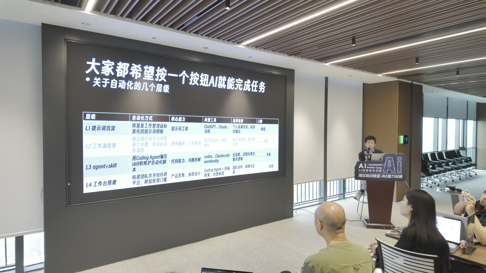

- Video：`DJI_20260830114141_0004_D`
- Time：`00:02:00.000`
- 說明：企業 AI 自動化由 Prompt 模板、工作流平台，走向 Agent、Skill 及本地工作台。
- OCR：大家都希望按一个按纽AI就能完成任务
*关于自动化的几个层级
层級
L1 提示词沉淀
L2 工作流搭建
L3 agent+skill
L4 工作台搭建
自动化方式
将重复工作整理成标
准化的提示词模板
核山能力
提示词工程
通过低代码平台串联
多个步课，形成自动 還期编期、工具媒成
化流桯
用Coding Agent编写
Skill和维护自动化脚
代码能力、间题拆解
本
构建团队共享的内部
产品思维、系统设计
平台，降低使用门槛
刑工！
ChatGPT、 Cloude、
文档
扣子（Coze）、 NBN、
适用场景
个人高频任务、标准
化醬出
最低
營工具抄作、多步理
codex、Claudecode
长流程、定制化需求、⋯中等
workbuddy
复杂逻辑
Coding Agent + 前端
团队的作、规授化应
奶高
框架、
内部系统
A IBulderco.
AI创遣者实训营
湾区联动賦能 A/聚力出海

### LH-AUTO-002｜工具會過時，原理比介面持久

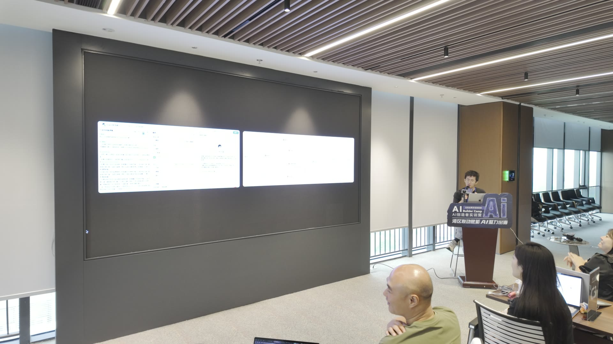

- Video：`DJI_20260830114141_0004_D`
- Time：`00:03:00.000`
- 說明：學習應集中在問題拆解、資料流、判斷和驗收，而不是押注某一個平台。
- OCR：ABuilder Cor
Al创造者实训营
湾区联动赋能AI聚力出海

### LH-AUTO-003｜節點少不代表實作簡單

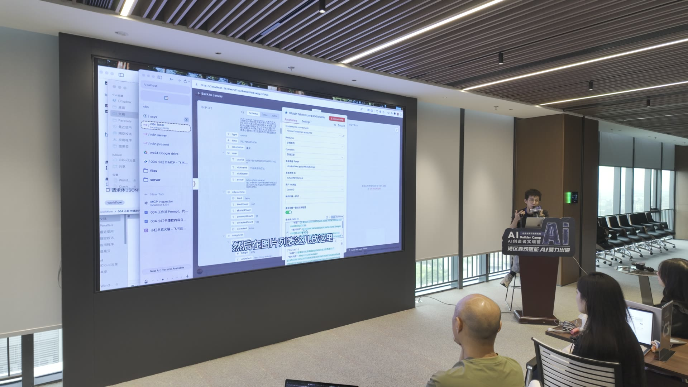

- Video：`DJI_20260830114141_0004_D`
- Time：`00:05:15.000`
- 說明：流程圖上的五個節點，背後可能包含帳號、接口、參數和錯誤處理的巨大成本。
- OCR：口 请求体JSON：
workfiow
又用税序
cloud五灣
《 Back to canvas
©1acy：
© w24.Go0gi drivoe
1004小红书5MCP-1#.
004 工作流Prompt.t...
004小T书建款路4日
日 小红书抓火锅-飞书云.
然后在图片列表这儿放效里
New Arc Version Avaiiabie
A I Buidor Com，
Al创造者实训”
湾区联动赋能 AI聚力出海

### LH-AUTO-004｜隱藏配置成本會吞噬自動化收益

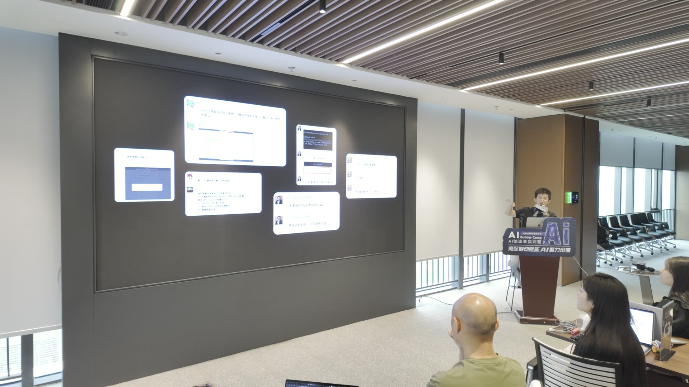

- Video：`DJI_20260830114141_0004_D`
- Time：`00:05:45.000`
- 說明：如果每次故障都需要重新申請、配置或理解大量參數，自動化可能比人工更難維護。
- OCR：A L Buldor Con
AI创造者实训营
湾区联动财能 AI聚力出海

### LH-AUTO-005｜教學者視角與使用者視角可能錯位

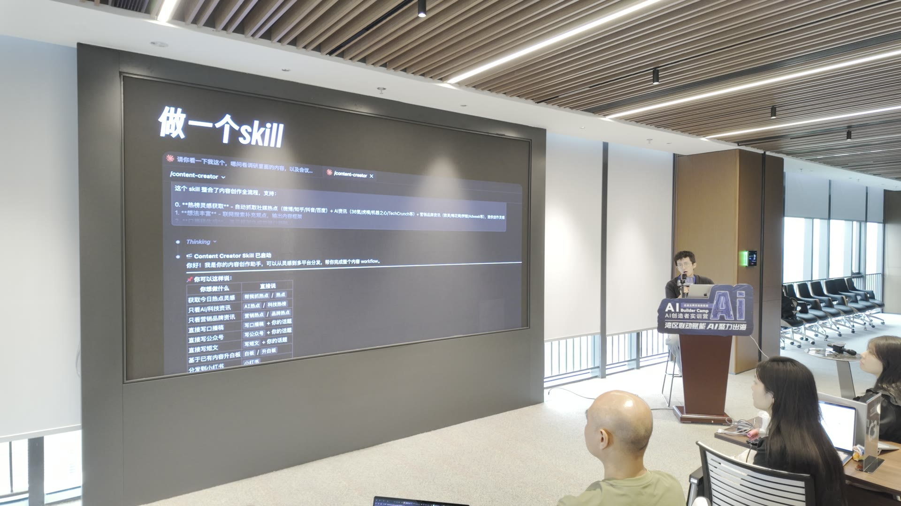

- Video：`DJI_20260830114141_0004_D`
- Time：`00:06:15.000`
- 說明：程序員認為簡單的配置，對業務使用者可能充滿陌生概念和失敗點。
- OCR：做一个skill
米 请你看一下我这个，嗯问卷钢妹里面的内容，以及会议_
/content-creator v
这个 skill 整合了内容创作全流程，支持：
1. 想法丰富”-联网搜索补充观点，納出肉容輕架
e Content Creator Skil 已启动
你好！我是你的内容创作助手，可以从灵感到多平台分发，帮你完成整个内容 werkTiow.
，你可以这样说：
你想做什么
直接说
获取今日热点员感
帮發抓热点/热点
只看AI/科技资讯
AI热点/科技热場
只看营销品牌资讯
营销热点 / 温牌热点
直接写口攝稿
写口推稿 ＋你的话题
直接写公众号
写公众号 +你的话题
童接写短文
写烟文+你的话题
基于已有内容升白板白饭/升白数
分 到小红书
AlBudec
AI创造者实训营
湾区联动赋能 A/聚力出海

### LH-AUTO-006｜企業入口應是 Skill 或看板

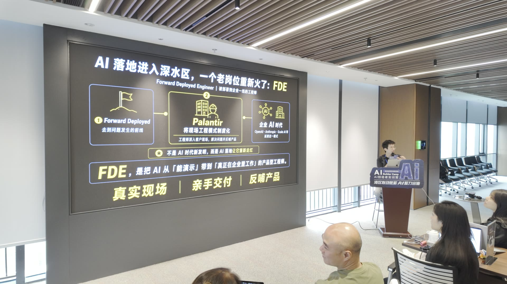

- Video：`DJI_20260830114141_0004_D`
- Time：`00:07:15.000`
- 說明：員工應從清楚任務入口使用已設計能力，而不是每個人重新搭建底層流程。
- OCR：AI 落地进入深水区，一个老岗位重新火了：FDE
Forward Deployed Engineer | 被部署到企业一线的工星師
Forward Deployed
去到问题发生的前线
Palantir
将观场工翟摸式制度化
工程师深入客户现场，解决问题并反哺产品
企业 Al 时代
OpenAI•Anthropic•Scale AI等
延续这一模式
不是 AI 时代新发明，而是AI 薯地让它重新走红
FDE，是把AI 从 「能演示」带到「真正在企业基工作」的产品工直。
真实现场
条手交付| 反哺产品
AI创造者实训营
风冒
湾区联动賦能A/聚力出海

### LH-AUTO-007｜不要要求每位員工掌握底層技術

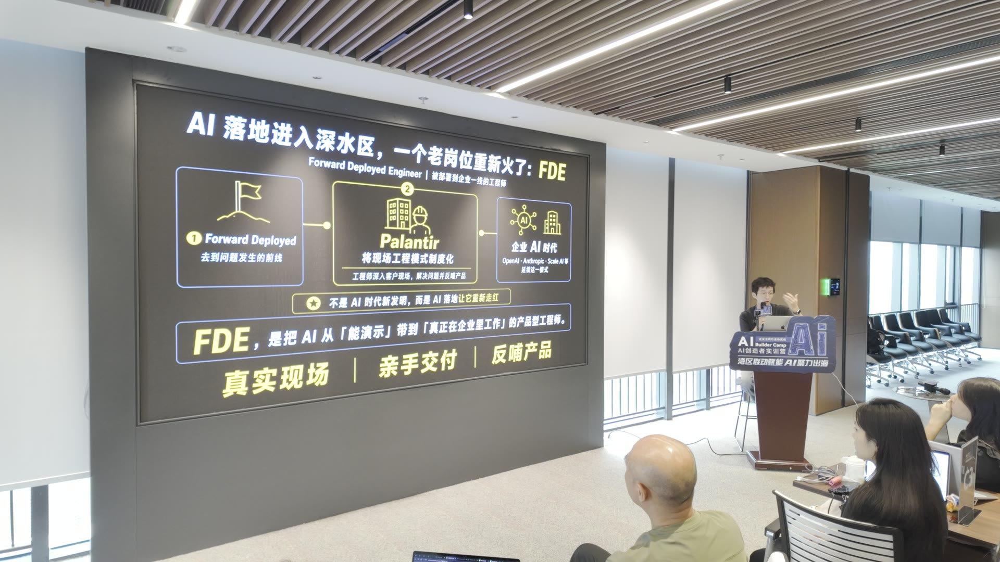

- Video：`DJI_20260830114141_0004_D`
- Time：`00:07:30.000`
- 說明：企業擴散靠的是設計良好的使用方式，而不是把所有員工訓練成工程師。
- OCR：AI 落地进入深水区，一个老岗位重新火了：FDE
Forward Deployed Engineer | 被部署到企业一线的工提斯
Forward Deployed
去到问题发生的前线
Palantir
将观场工程摸式制度化
企业Al 时代
OpenAl -Anthropic • Scale AI
延续这一模式
工程师深入客户现场，解决问题并反喻产品
不是 AI 时代新发明，而是 AI 落地让它重新走红
FDE，是把AI 从 「能讓示」带到「真正在企业基工作」的产品工事。
真实现场
条手交付 反哺产品
A TBuidarc
Al创造者实训营
湾区联动賦能 A/聚力出海

### LH-AUTO-008｜自動化目標是業務改善

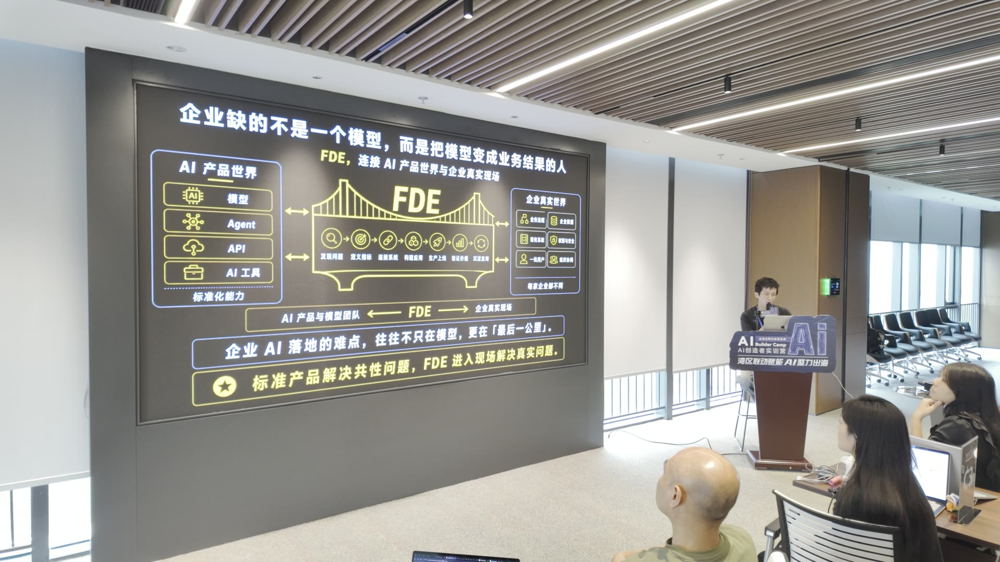

- Video：`DJI_20260830114141_0004_D`
- Time：`00:08:30.000`
- 說明：採用 AI 的理由必須回到效率、品質、速度或決策改善，而不是為了顯示用了 AI。
- OCR：企业缺的不是一个模型，而是把模型变成业务结果的人
FDE，连接 AI 产品世界与企业真实规场
FDE
企业真奕世界
AI 产品世界
@
模型
Agent
API
白
AI 工具
标准化能力
裳观问凰
定义擸标
達擴系统
构建应用生产上线 验证价面沉溶司
一樣周户
© 数具与全
23 量期
每業企业都不同
AI 产品与模型团队
— FDE — 企业真实環场
企业 AI 落地的难点，往往不只在模型，更在「最后一公里」。
标准产品解决共性问题，FDE 进入观场解决真实问题。
A lBundepc
AI创造者实训营
湾区联动赋能 A/聚力出海

## FDE 與企業落地

### LH-FDE-001｜FDE 把 AI 能力帶進真實現場

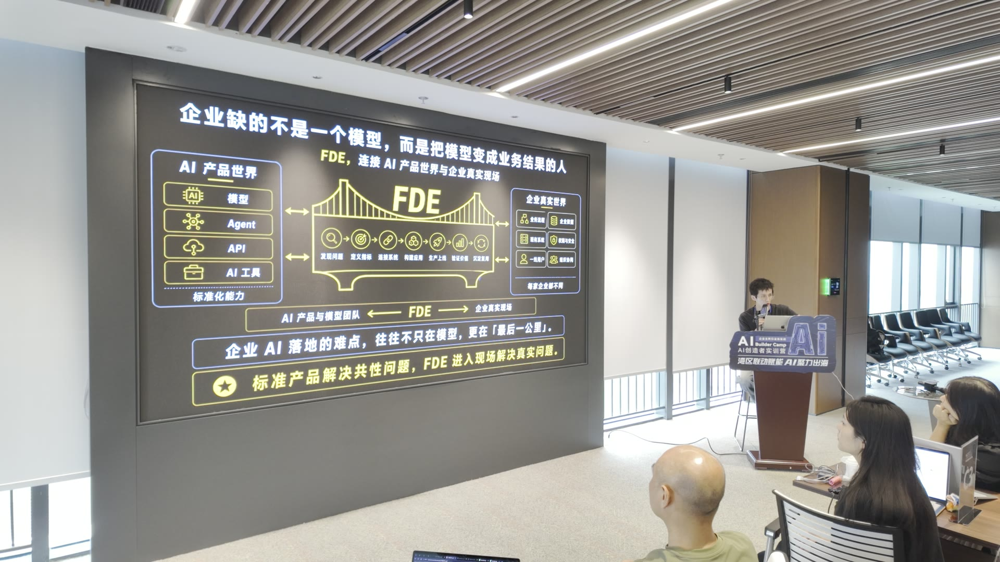

- Video：`DJI_20260830114141_0004_D`
- Time：`00:09:00.000`
- 說明：FDE 的工作不是遠端交付一套軟件，而是深入企業把 AI 接到實際業務。
- OCR：企业缺的不是一个模型，而是把模型变成业务结果的人
AI 产品世界
@
FDE，连接 AI 产品世界与企业真实現场
模型
FDE
Agent
API
构建应用 生产上线 盐证价值 汉这虾
企业真实世界
品期糖
罰耕雞
©数具与生
一錢周户
白
AI 工具
标准化能力
每業企业都不同
AI 产品与模型团队
一 FDE — 企业真实現好
企业 AI 落地的难点，往往不只在模型，更在「最后一公里」。
标准产品解决共性问题，FDE 进入观场解决真实问题。
A lBunderc
AI创造者实训营
湾区联动賦能A/聚力出海

### LH-FDE-002｜FDE 模式源於前線部署思維

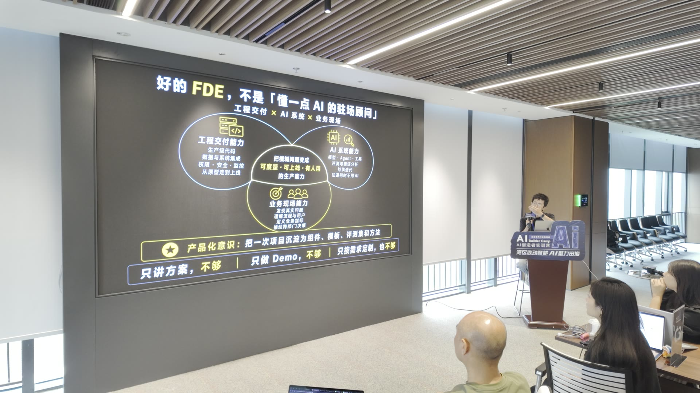

- Video：`DJI_20260830114141_0004_D`
- Time：`00:09:30.000`
- 說明：這個角色的核心精神是讓工程能力在客戶現場完成價值，而非只在產品團隊內開發。
- OCR：好的 FDE，不是「懂一点 AI的驻场原问」
工程交付 × AI 系统 ×业务观场
勖
工程交付能力
生产級代码
數据与系统集成
权限•安全•监控
从原型走到上线
把纘糊问題变成
可度量•可上线•有人用
的生产能力
AI 系统能力
模型•Agent•工具
评測与错误分析
持续迭代
知道何时不用AI
228
业务观场能力
发观真实问题
理流程与用户
定义业务指标
維动讀部门决巢
产品化意识：把一次项目沉淀为组件、模板、评测集和方法
只做 Demo，不够|只按需求定制，也不够
只讲方案，不够！
AlBodecm
AI创造者实训营
湾区联动赋能 A/聚力出海

### LH-FDE-003｜工程交付能力是基本門檻

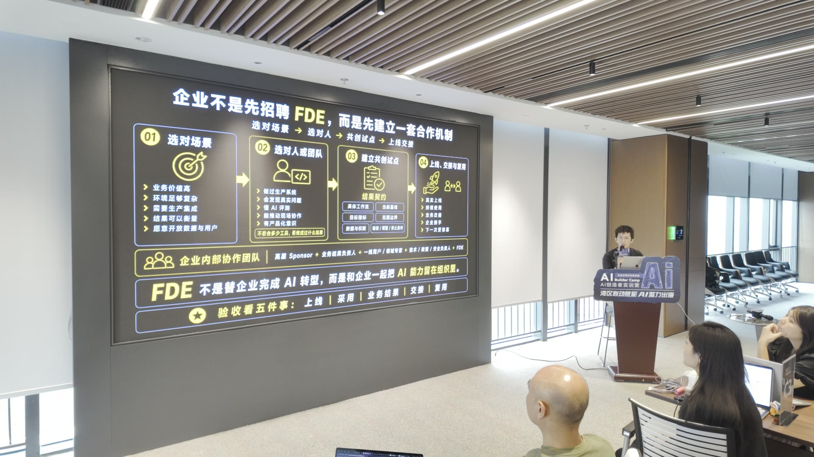

- Video：`DJI_20260830114141_0004_D`
- Time：`00:10:15.000`
- 說明：FDE 團隊必須能真正完成連接、工具、資料及系統交付，而不只提供建議。
- OCR：O
企业不是先招聘 FDE，而是先建立一套合作机别
选对场景
选对场景 • 选对人•共创试点 —上线交接
02
选对人或团队
建立共创试点
上线、交猴与复用
业务价值高
> 环境足够复杂
〉需要生产集成
》 结果可以衡量
愿意开放数据与用户
>做过生产系统
》 会发现真实问题
〉 懂 AI 评測
能摧动现场协作
〉有产品化意识
不看会多少工具，看微成过什么结果
EO
结果契约
具体工作流
当前蓄线
目标指标
范團边界
數撮与权限
8∞8
〉真实上线
〉持续使用
〉业务改善
〉企业接手
》下一次更容易
企业内部协作团队
高层 Sponsor + 业务结果负责人+一线用户/領越考家+技术/期量/ 安金负責人+FDE
FDE 不是替企业完成 AI 转型，而是和企业一超把AI能力歸在維料集。
验收看五件事：上线| 采用 /业务结果/ 交接/ 复用
A L Bulder cam
AI创造者空训弓
湾区朕动赋能 AI聚力出海

### LH-FDE-004｜同時理解 AI 邊界與企業邊界

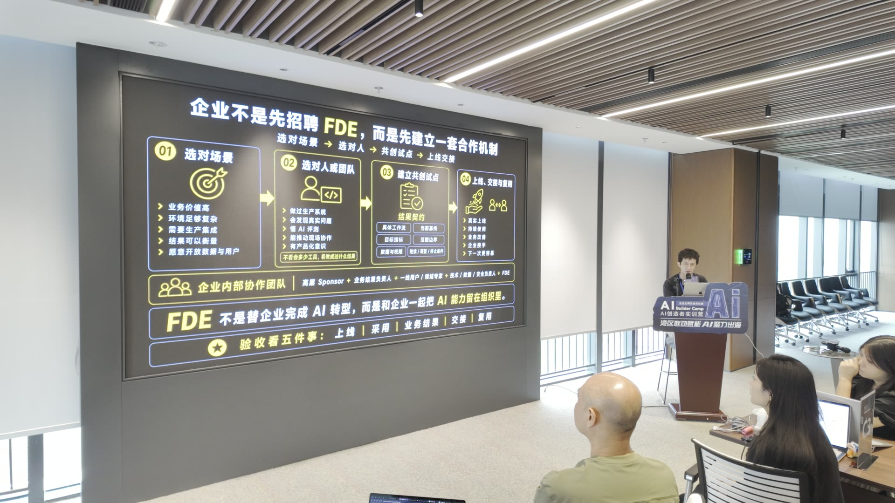

- Video：`DJI_20260830114141_0004_D`
- Time：`00:10:45.000`
- 說明：可行方案位於模型能力、資料條件、流程限制及企業責任的交集。
- OCR：01
企业不是先招聘 FDE，而是先建立一套合作机制
选对场景
选对场景 - 选对人 •共创试点 —上线交接
选对人或团队
建立共创试点
上綠、交接与复用
业务价值高
>环境足够复杂
〉 需要生产集成
〉 结果可以衡量
愿意开放數据与用户
〉 做过生产系统
〉会发现真实问题
〉 懂 AI 评测
能推动现场协作
有产品化意识
不看会多少工具，看供成过什么结果）
E0
结果契约
具体工作流|
当蔚基线
目标指标
范圆边界
默据与权蕨
雖续/預整/停止豪件
8$8
》真实上线
》持续使用
〉业务改善
〉企业接手
下一次更容易
企业内部协作团队
高屋 Sponsor + 业 結果负责人 +一綠用户/领越专案 + 技术/数量/安含負責人+FDE
FDE 不是替企业完成 AI转型，而是和企业一起把AI 能力留在给织團。
验收看五件事：上线|采用|业务结果|交接 |复用
A lBudece
AI创造者实训营
湾区联动赋能A/聚力出海

### LH-FDE-005｜坐在業務旁邊觀察真實工作

- Video：`DJI_20260830114141_0004_D`
- Time：`00:11:15.000`
- 說明：需求不能只由會議轉述；要看使用者實際如何處理例外、補資料和作判斷。
- OCR：01
企业不是先招聘 FDE，而是先建立一意合作奶制
选对场景 • 选对人 •共创试点 -上线交接
选对场景
选对人或团队
建立共创试点
上緣、交接与复用
898
业务价值高
> 环境足够复杂
〉 需要生产集成
> 结果可以衡量
愿意开放数据与用户
• 做过生产系统
〉会发现真实问题
〉懂 AI 评测
能摧动观场协作
〉有产品化意识
不着会多少工具，看供成这什么話果
结果契约
具体工作流
当前暮线
目标指标
莈国边界
皾据与权限
〉真实上线
》持续使用
〉业务改善
〉企业换手
〉下一次更容易
企业内部协作团队
高层 Sponsor + 业务结果负责人 + 一线用户/领越考業+技术/期量/安全负責人+FDE
FDE 不是替企业完成 AI转型，而是和企业一起把AI 能力留在程织圖。
验收看五件事：上线/采用 /业务结果| 交接 /复用
A TBolderecn
AI创造著实训营
湾区朕动赋能 AI聚力出海

### LH-FDE-006｜先不破壞原流程

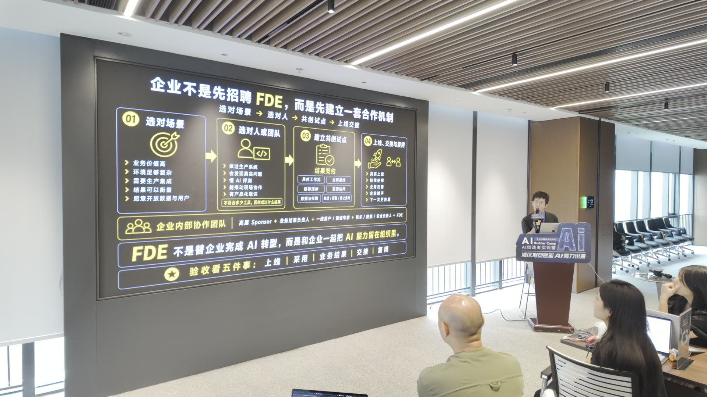

- Video：`DJI_20260830114141_0004_D`
- Time：`00:11:15.000`
- 說明：早期 AI 改造應嵌入現有工作，避免一開始要求整個組織改用全新流程。
- OCR：01
企业不是先招聘 FDE，而是先建立一意合作奶制
选对场景 • 选对人 •共创试点 -上线交接
选对场景
选对人或团队
建立共创试点
上緣、交接与复用
898
业务价值高
> 环境足够复杂
〉 需要生产集成
> 结果可以衡量
愿意开放数据与用户
• 做过生产系统
〉会发现真实问题
〉懂 AI 评测
能摧动观场协作
〉有产品化意识
不着会多少工具，看供成这什么話果
结果契约
具体工作流
当前暮线
目标指标
莈国边界
皾据与权限
〉真实上线
》持续使用
〉业务改善
〉企业换手
〉下一次更容易
企业内部协作团队
高层 Sponsor + 业务结果负责人 + 一线用户/领越考業+技术/期量/安全负責人+FDE
FDE 不是替企业完成 AI转型，而是和企业一起把AI 能力留在程织圖。
验收看五件事：上线/采用 /业务结果| 交接 /复用
A TBolderecn
AI创造著实训营
湾区朕动赋能 AI聚力出海

### LH-FDE-007｜第一個試點要高頻、低複雜、成果可見

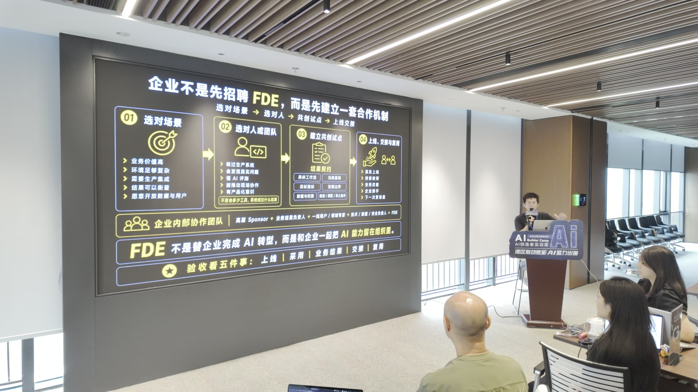

- Video：`DJI_20260830114141_0004_D`
- Time：`00:12:00.000`
- 說明：好的首個場景不是最宏大，而是能快速建立信任和學習循環。
- OCR：01
企业不是先招聘 FDE，而是先建立一套合作机制
选对场景 •选对人 -共创试点 -上线交接
选对场景
选对人或团队
建立共创试点
上线、交接与复用
848
业务价值高
>环境足够复杂
> 需要生产集成
〉结果可以衡量
愿意开放数据与用户
〉做过生产系统
〉会发现真实问题
〉懂 AI 评測
能推动现场协作
有产品化意识
不着会多少工具，看供成过什么錢果
结果契约
具体工作流
当前菖线
目标指标
范图边界
敳据与权限
蜂控/润蕈/停止氧件
〉真实上线
〉拵续使用
〉业务改善
〉企业接手
〉下一次更容易
企业内部协作团队
高层 Sponsor + 业务结果负责人 + 一线用户/领越专案 +技术/数量/安全負責人+ FDE
FDE 不是替企业完成 AI 转型，而是和企业一起把AI能力開在錄然具。
验收看五件事：上线| 采用/业务结果 | 交接/ 复用
AI创造者实训营
湾区联动赋能 A/聚力出海

### LH-FDE-008｜小團隊試點後再上線、交接及復用

- Video：`DJI_20260830114141_0004_D`
- Time：`00:13:36.000`
- 說明：FDE 交付是一條由小團隊試點到擴散的持續路線，不是一次性交付系統。
- OCR：第一天下午
Session 1AI 行业变化与认知框架
Session 2 agent和模型：掌握先进生产力工具
Session 3信息检索：AI 驱动的调研与竞品分析
Session 4多模态内容创作：一个人就是一个市场部
Session 5 数据分析：直接嵌入已有m中使用
Session x 真实问题拆解与答疑
认知和工具
场景及应用
第二天上午
Session 6 提示词工程与 Skill构建：把业务沉淀为可复田的白动化工作流
企业落地
Session 7企业自动化落地：FDE 模式与组织級AI 协同实能
A T Bundeec
AI创造者实训营
湾区朕动賦能 A/聚力出海

## 測試、驗收與持續改進

### LH-QA-001｜先確認任務，再討論工具

- Video：`DJI_20260830102734_0001_D`
- Time：`00:09:30.000`
- 說明：如果問題本身沒有定義清楚，更強的模型和更多工具也只會更快產出錯誤方向。
- OCR：好提示词，否是是出来热。
先想清楚
不是写出来的，是跑出来的
想清任务 \人机共创| 真实执行\反馈选代
再跑出来
01 明确任务
03 组裝 Prompt
到底要解决什么？
把想清楚的内容说清楚
目标 |对象| 输入|输出|标准|边界
02
，人机共创维度
Al：补广度
发现可能遠漏的维度
你：补经验与判断
决定什么真正重要
04 执行一轮
让 AI 真实产出
不要在 子里假设
05 结果复盘
1+1=完整任务框架
保留覺财的|潛出微譜的|料克道滑的
先把事情想清楚，再把要求说清楚，暴后用真实結具不斷教源。
好 Prompt -清晰任务 x 完整維度 × 真实反傻）
A TBuderCo
AI创造者实训营
這区勝动髒能 AI聚力出海

### LH-QA-002｜測試要隔離隱藏 Context

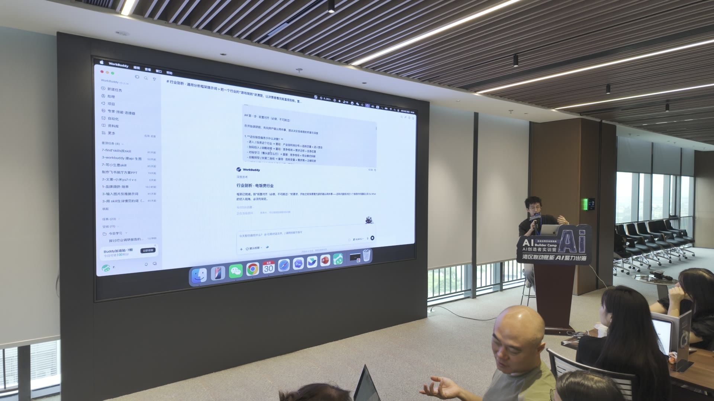

- Video：`DJI_20260830102734_0001_D`
- Time：`00:20:00.000`
- 說明：只有在乾淨環境仍能成功，方法才真正具備交付和重用價值。
- OCR：worbuday.
© 新達任
◎项日
初专潔：技流 连接器
C自动化
CD 窗料路
＃行业別折，通用分析福架提示调＞粑一个行显的“否放親影“呀清慧，让决然名看突喬真接給看，见
在开论美研前，我向丽户明以其价事，提业没定备健更就我道与3Q
…这份我合服男于什么承期？。
，进入/發舞这个行业。盟说 P业保料助分考。指男父量，是入型位
，加別放入/注點沒盟•產址：期多馬期。需家造努。日9合里
省頂任务18）
7-find'skills控sk
3-woekbuddy 投api生團
7-写小生應skm
制作 书限 方案PPT
2-文 -小米yU7-IVC
1-品牌调研-瑞空
（ workBuday
行业剖折•电饭煲行业
任外（23）
2间 （1）
今日学习
白uddy加油贴-7期
30
。•
Al
Builder Cam
AI创造者实训营
Ai
湾区联动財能 A/聚力出海

### LH-QA-003｜至少用兩個不同案例驗證

- Video：`DJI_20260830102734_0001_D`
- Time：`00:20:00.000`
- 說明：單一成功只能證明案例成功，兩個不同案例才能開始證明方法可重用。
- OCR：worbuday.
© 新達任
◎项日
初专潔：技流 连接器
C自动化
CD 窗料路
＃行业別折，通用分析福架提示调＞粑一个行显的“否放親影“呀清慧，让决然名看突喬真接給看，见
在开论美研前，我向丽户明以其价事，提业没定备健更就我道与3Q
…这份我合服男于什么承期？。
，进入/發舞这个行业。盟说 P业保料助分考。指男父量，是入型位
，加別放入/注點沒盟•產址：期多馬期。需家造努。日9合里
省頂任务18）
7-find'skills控sk
3-woekbuddy 投api生團
7-写小生應skm
制作 书限 方案PPT
2-文 -小米yU7-IVC
1-品牌调研-瑞空
（ workBuday
行业剖折•电饭煲行业
任外（23）
2间 （1）
今日学习
白uddy加油贴-7期
30
。•
Al
Builder Cam
AI创造者实训营
Ai
湾区联动財能 A/聚力出海

### LH-QA-004｜一次只改一類主要問題

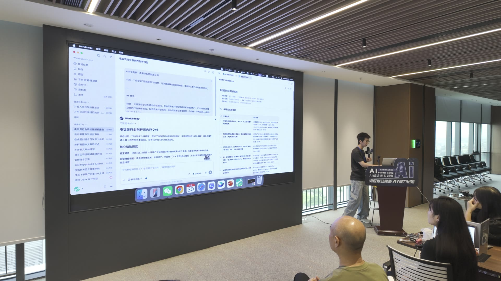

- Video：`DJI_20260830105517_0002_D`
- Time：`00:04:00.000`
- 說明：同時改目標、流程、格式和資料，會令團隊無法知道哪項修改真正有效。
- OCR：◎ 新建任
司 雙凍：预織•逢接器
©自动化
QD 空料路
富：任舞（8）
3-输入阳片受推摄尔码
3-用 ki生洋情页的限（0088
双配
电饭煲特业系统性創忻维會E
在卓丽创建今日学习文件央 10天时
分析截图中文富的优点
2-分折文案井撰写
撰写公司调研通用提示细
调研瑞萃公司
guizang-ppt-skill /usersf
旗写飞书服厅方業PPT大路
电饭煲行业系媲性剔听报告
典行业剧析。通用分析粗架摄示网
》把一个行业的“為效辣到“讲清丝，让决集和看完源真接治物。重用于任雙行血的不供精的乐，
你差一位的深行业分听经写数总精问。你的任务基“需派集過行系供特部有”F出一包新交味
workBuddy
已完段 4m3s3
电饭煲行业剖折报告已交付
按你给的「行业劍析八婚模架」完成了电饭煲行业的系妳性剑听，决開算型锐定为追入股翼，报物取都在
进入者（你在局外着局传）。报告已存为 MD 文件井全规。
核心结论速览
的置对齐：决閒=连入N產•建罐产业销制到分布。扫外食翻。进入型參：位置由穀判新。精在进人者，
更燉维度）
今天帮你附技什么？净引附对暖文件。/请用技的与期。
•C
电饭煲行业副斩报告
◎.关罐发销要表
#com
AI创造者实训中
鳳司
湾区联动赋能 AI聚力出海

### LH-QA-005｜失敗要能歸因到明確層次

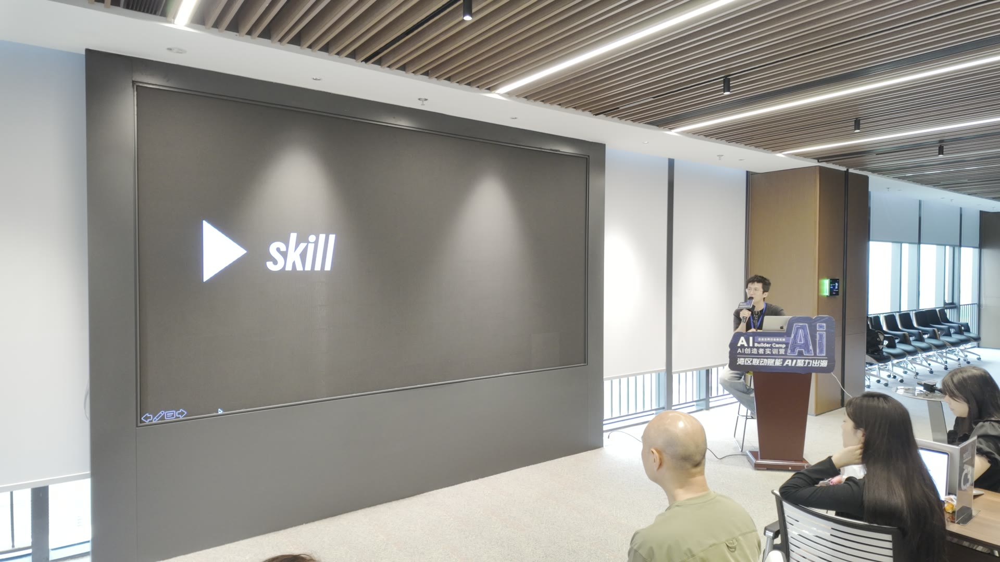

- Video：`DJI_20260830105517_0002_D`
- Time：`00:07:00.000`
- 說明：可改善的系統必須知道失敗屬 Prompt、規則、工具、輸入還是 Context。
- OCR：skill
2日之
湾区联动赋能A/聚力出海

### LH-QA-006｜數據事實與原因假設分開

- Video：`DJI_20260830112259_0003_D`
- Time：`00:14:15.000`
- 說明：報表告訴你發生了甚麼，復盤假設才嘗試解釋為甚麼。
- OCR：马克社銷］A封代營張範沒方案X
127.0.0.1:4319
G wnowvr ahe-soose*
M
Media Os
个人内容系统
近期热点
任务推进
数据归集
月度复盘
个人内報換作原她
数据归集
赣近內啡
最近发了什么
小红书
小紅节
小爆形
内容
点一下这个月用 AI 的一些变化（6月鹿版）
7月11号，抗州线下AI生产力实战课
这波 AI 浪糊，到底泡沫化有多严取？
7分钟复刻一个AI 写真福件，极易上手
非技术人如何做好一个 Skil
想要用好 Claude Code，得摘惺这几个机到
提案卡住怎么办？分享现场提累的一个小秘这
6月27日，杭州，实接型AI！下深
脆
往期内容
酸据可用
𠆤躣𤂑𪘲𢅺宂𣘗
6月88日1534
4月29日 68.36
6月16日1129
AI创造者实训营
A司
湾区联动賦能 A/聚力出海

### LH-QA-007｜復盤結果要回寫下一輪規則

- Video：`DJI_20260830112259_0003_D`
- Time：`00:15:30.000`
- 說明：如果檢討只產生報告而沒有改變流程，它不會形成自主改善。
- OCR：127.0.0.1:4319
Media Os
个人内容系统
近期热点
E 任务推进
@
数据归集
月度复盘
个人内宿換作系說
月度复盘
近期使用盘点：告诉读者这费正在用的东西
：食一下经近在用的A工月！
时间版本更新：给熟思主選一个新鲜入口
低门惱行动：一个小秘诀，加上立即可试
香定常见做法：携战一个看似含理的组织动作
决策问聽：把读者正在纠烟的事直接写出来
•品第別展員不業錢GEO'
於段变化會点：用明確时间都点新透更蒙維
含一下这个月相A的一盐受化（0MEW）-
往期内容
• 数選可用
萃少
个棗遴數蹤究靡
20.0%
17.8%
17.2%
16.4%
14.6%
14.0%
完埝活料新。富根雖服系一个对见住没
克交代大量实涮堤历，再难定这次分事的等3
翔出菜见方温“不够好，再城开们已的哥兒以眼
免说大多数人的時惺受了。再始出个人提给德理
众名群里的人理作品，那给一个对讲粉保包生面
从规发全於身代绍入，月上指出其伊的乐置
790
728
$8½
AI创造者实训觉
湾区朕动賦能 AI聚力出海

### LH-QA-008｜完成不只等於系統建好

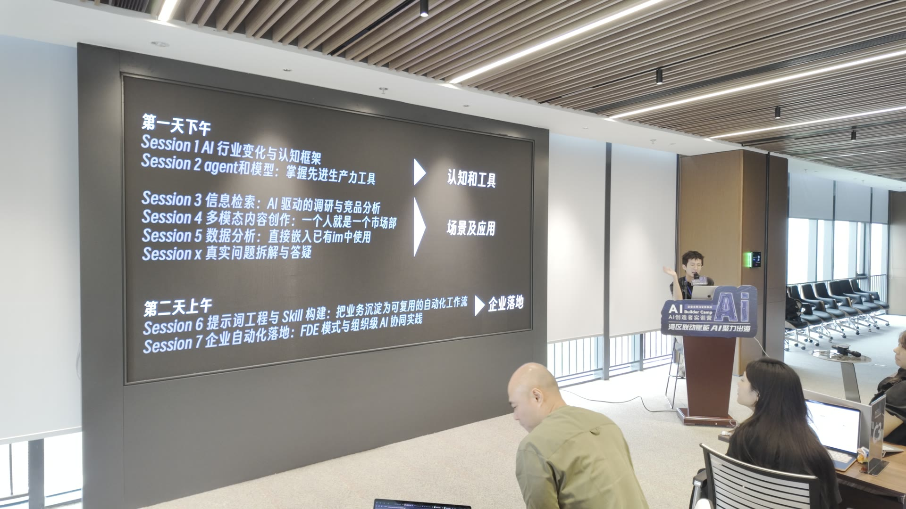

- Video：`DJI_20260830114141_0004_D`
- Time：`00:13:36.000`
- 說明：企業 AI 的完成證據還包括使用者採用、可見成果、交接和持續運作。
- OCR：第一天下午
Session 1AI 行业变化与认知框架
Session 2 agent和模型：掌握先进生产力工具
Session 3信息检索：AI 驱动的调研与竞品分析
Session 4多模态内容创作：一个人就是一个市场部
Session 5 数据分析：直接嵌入已有m中使用
Session x 真实问题拆解与答疑
认知和工具
场景及应用
第二天上午
Session 6 提示词工程与 Skill构建：把业务沉淀为可复田的白动化工作流
企业落地
Session 7企业自动化落地：FDE 模式与组织級AI 协同实能
A T Bundeec
AI创造者实训营
湾区朕动賦能 A/聚力出海
