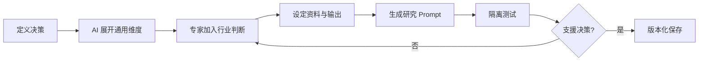

# 行业研究 Prompt 共创流程

## 目的

把「帮我研究某行业」转成包含决策目的、行业判断、资料要求及验收标准的可重用 Prompt。

## 必要输入

- 报告接收者及要做的决策。
- 行业、地区、时间范围及公司位置。
- 已知资料、必查来源及不可接受来源。
- 三条由从业者提供的实务判断。

## 角色

- 业务专家：提供行业权重、例外及决策语境。
- AI／Agent：扩展分析维度、整理 Prompt 及执行研究。
- 验收者：判断报告是否支援原决策。

## 前置检查

- 先完成目标、对象、输入、输出、标准、边界六栏。
- 把事实、假设及待查问题分开。

## 操作步骤

1. 用一句话写清楚报告完成后，接收者要作哪项决定。
2. 要求 AI 提出产业基本面、价值链、竞争、需求、趋势及风险等候选维度。
3. 由业务专家删除低价值维度，加入政策、渠道、客群、指标及内部限制。
4. 为每个核心维度指定资料来源、时间范围、信度及缺资料时的处理方式。
5. 固定交付结构，包括摘要、证据、分析、风险、建议及未知项。
6. 生成正式 Prompt，移到新窗口，以另一个相近细分类执行。
7. 对照决策需要，记录遗漏、错误权重及没有证据的结论。
8. 修订后保存版本、案例及适用行业边界。

## 决策分支

- 若业务专家无法补充判断：先做探索研究，不把结果标成专家级报告。
- 若资料不足：交付未知项及补资料建议，不要求 Agent 补写确定结论。
- 若换行业后失效：保留通用骨架，另外建立行业专用层。

## 产出物

- 六栏研究 Brief。
- 行业研究 Prompt v01 或以上。
- 测试输出及差距记录。

## 验收标准

- 报告明确支援一项决策。
- 每个重要结论可连回来源。
- 至少加入三条人类行业判断。
- 已在干净窗口和第二案例通过测试。

## 常见失败及修复

- 维度很多但没有优先级：由决策问题反推必读章节。
- 报告像百科：加入公司位置、竞争选择及行动门槛。
- AI 自行假设资料：强制标示缺口及信心水平。

## 证据

- Video：`DJI_20260830102734_0001_D`
- 时间：`00:02:00–00:18:30`
- 状态：Cleaned Review；流程是依课堂方法整理的可执行版本。
