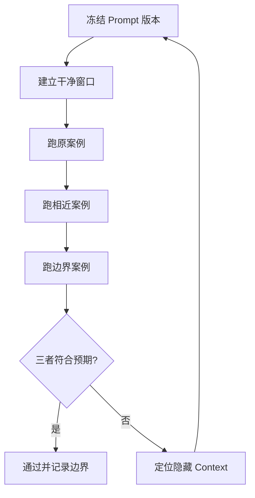

# Prompt 新窗口隔离测试流程

## 目的

证明 Prompt 不依赖作者原本对话中的隐藏背景，并能在第二个相近案例中重现合格结果。

## 必要输入

- 待测 Prompt 及版本号。
- 原成功案例、相近案例及一个边界案例。
- 可逐项判断的验收清单。

## 角色

- 设计者：提供 Prompt 和预期用途。
- 测试者：只使用正式输入，不补充口头背景。
- 验收者：比较三个案例的结果。

## 前置检查

- 关闭或离开原设计对话。
- 确认新窗口没有载入旧项目资料。
- 固定模型和工具条件，避免同时改变多个变量。

## 操作步骤

1. 保存 Prompt、模型条件、工具及验收表，形成不可混淆的测试版本。
2. 在干净窗口只贴入正式 Prompt 和原案例输入，禁止补充设计对话内容。
3. 逐项核对输出，记下 Prompt 没有明写但模型似乎猜中的内容。
4. 使用相近但不同资料的第二案例，检查方法是否过度配合原案例。
5. 使用缺资料或接近适用边界的案例，观察能否停止、提问或标示未知。
6. 把失败归因为输入缺漏、规则过窄、格式不清或隐藏 Context。
7. 只修改一类主要问题，建立下一版本并重跑失败案例。

## 决策分支

- 原案例在新窗口失败：Prompt 尚未自包含，先补必要背景。
- 第二案例失败：把行业专用规则与通用骨架分离。
- 边界案例仍自信作答：加入停止条件、缺资料处理及人工升级。

## 产出物

- 三案例测试记录。
- 隐藏 Context 缺口清单。
- 通过或退回结论。

## 验收标准

- 原案例在干净窗口重现合格结果。
- 第二案例达到同一核心验收标准。
- 边界案例不会把未知资料写成事实。
- 测试者无需作者口头补充。

## 常见失败及修复

- 测试者知道答案并主动补充：改由另一位同事盲测。
- 模型版本不同造成差异：记录环境并分开比较。
- 只看成品感觉：把验收改成可逐项勾选。

## 证据

- Video：`DJI_20260830102734_0001_D`
- 时间：`00:18:00–00:22:00`
- 状态：Cleaned Review。
