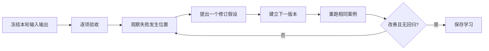

# Prompt 结果复盘与版本升级流程

## 目的

把「这次不好」转成可追溯的差距、最小修改及下一版本，避免无方向地反覆重写。

## 必要输入

- Prompt 版本、正式输入及完整输出。
- 任务验收标准。
- 中途工具及步骤记录。

## 角色

- 执行者：保存输入输出和中途观察。
- 业务验收者：指出结果对实际工作是否有用。
- 维护者：决定哪些学习升级为共用规则。

## 前置检查

- 先分辨事实错误、方法缺漏、格式问题及偏好差异。
- 每一轮只选一个主要假设进行修改。

## 操作步骤

1. 保存本轮 Prompt、输入、输出、模型条件及完成时间。
2. 用验收表标出通过、失败、未能判断及超出范围项目。
3. 回看 Agent 中途行为，定位偏差由哪一步开始。
4. 将主要原因标记为目标、流程、格式、背景、工具或输入。
5. 写出一条修订假设，例如「加入来源优先级可减少无证据结论」。
6. 只修改相关规则，版本号加一，使用相同输入重跑。
7. 比较新旧结果，确认改善没有破坏原本通过项。
8. 经两个案例验证后，才把学习加入共用 Prompt 或 Skill。

## 决策分支

- 结果改善但成本大增：按业务价值决定是否接受。
- 一个案例改善、另一案例变差：将规则改为条件分支。
- 问题来自工具：不要用 Prompt 补救，转到工具或资料层修复。

## 产出物

- Prompt 版本纪录。
- 差距和失败归因。
- 新旧输出对照及升级决定。

## 验收标准

- 每次版本只改变有清楚理由的规则。
- 新版本改善指定失败，没有破坏既有通过项。
- 升级规则至少通过两个案例。
- 可由第三者重现测试。

## 常见失败及修复

- 只写「效果不好」：改成对应具体验收项。
- 每轮整份重写：保留基准并做最小差异。
- 只看最终输出：回看工具和中间步骤。

## 证据

- Video：`DJI_20260830102734_0001_D`
- 时间：`00:08:00–00:27:42`
- 状态：Cleaned Review；版本控制细节为整理后操作规格。
