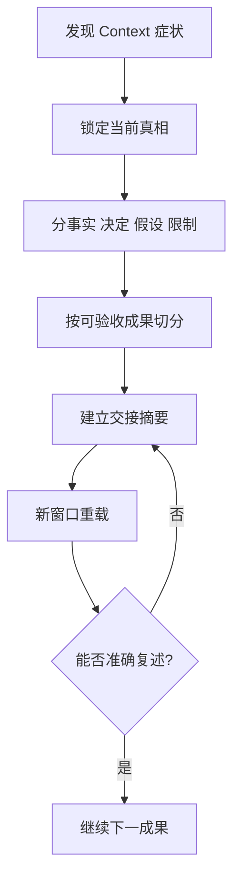

# Context 超载诊断与任务切分流程

## 目的

当 Agent 开始忘记约束、混合旧任务或反覆失准时，安全地把工作切成新窗口可延续的成果单元。

## 必要输入

- 当前任务目标、来源、规则及完成状态。
- 已确认决定、尚未确认假设及未完成项。
- 最近一次合格输出。

## 角色

- 任务负责人：确认哪些资讯不可遗失。
- Agent：协助整理，但不能自行把推测升级为决定。
- 下一阶段执行者：只依交接包重新开始。

## 前置检查

- 排除工具故障、权限或输入档案问题。
- 确认症状是遗忘、混线、重复或规则冲突。

## 操作步骤

1. 暂停新增要求，列出目前模型忘记或混淆的具体证据。
2. 以权威文件和已验收成果重建当前事实，不直接信任长对话摘要。
3. 分开写出目标、来源、规则、决定、假设、已完成及未完成。
4. 把剩余工作按可独立验收的交付物切分，不按字数平均分段。
5. 为下一交付物建立一页交接摘要及必要档案路径。
6. 在新窗口只载入交接摘要和当前交付物需要的来源。
7. 先要求 Agent 复述任务、限制和完成标准，再开始执行。
8. 完成后把结果和新决定回填主状态，不把整段新对话全部搬回。

## 决策分支

- 无法确认当前真相：停止执行，先由负责人裁决冲突来源。
- 任务不能切分：缩小输入，只保留支持当前一个判断的资料。
- 新窗口仍失准：问题可能在规格而非 Context，转入四层排错。

## 产出物

- Context 诊断记录。
- 一页交接摘要。
- 分阶段交付物清单。

## 验收标准

- 新窗口可准确复述目标、来源及限制。
- 没有把假设写成已确认决定。
- 每个剩余阶段都有独立完成标准。
- 下一位执行者不需要阅读整段旧对话。

## 常见失败及修复

- 摘要过长：只保留与下一成果有关的状态。
- 摘要过短：补上权威来源、禁止事项和验收。
- 开了新窗口仍带入全部历史：改用最小 Context 包。

## 证据

- Video：`DJI_20260830105517_0002_D`
- 时间：`00:00:00–00:02:00`
- 状态：Cleaned Review；交接栏位为整理后实作方法。
