# Prompt 四层排错流程

## 目的

用固定顺序把答非所问或品质不稳定的问题，定位至目标、流程、格式、背景或非 Prompt 系统层。

## 必要输入

- 原 Prompt、输入、输出及预期结果。
- 可重现的失败案例。
- 模型、工具和资料状态。

## 角色

- 业务验收者：指出哪项结果不能用。
- Prompt 维护者：逐层提出和测试修订。
- 工具负责人：接手非 Prompt 故障。

## 前置检查

- 用同一输入重现失败。
- 确认不是服务中断、档案不可读或权限问题。

```mermaid
flowchart TD
  A[重现失败] --> B{目标清楚?}
  B -- 否 --> B1[重写成果与对象]
  B -- 是 --> C{流程足够?}
  C -- 否 --> C1[补步骤与判断]
  C -- 是 --> D{格式可验收?}
  D -- 否 --> D1[固定结构]
  D -- 是 --> E{背景足够?}
  E -- 否 --> E1[补来源与限制]
  E -- 是 --> F[转查工具 输入 规则]
```

## 操作步骤

1. 把失败描述成「预期 X，实际 Y」，不要只写效果差。
2. 检查目标层：成果、使用者、决策及成功条件是否明确。
3. 检查流程层：是否提供研究、比较、判断、验证及停止步骤。
4. 检查格式层：输出结构、长度、栏位及引用要求是否可逐项验收。
5. 检查背景层：资料、术语、案例、限制及优先级是否足够。
6. 若四层均完整，转查 Context、输入品质、工具能力、权限及规则冲突。
7. 只修正首个主要缺口，保留其他条件不变并重跑。
8. 记录根因和结果；通过第二案例后才升级共用版本。

## 决策分支

- 多层同时缺失：先目标，再流程、格式、背景。
- 失败不能稳定重现：先收集更多案例，不立即修改共用 Prompt。
- 工具无能力完成：更换执行路径或缩小成果，不用语句掩盖能力缺口。

## 产出物

- 四层诊断表。
- 单一根因假设。
- 修订版本及新旧比较。

## 验收标准

- 失败可在固定案例重现。
- 修订只针对一个主要层次。
- 新结果改善指定问题。
- 非 Prompt 问题已转交正确负责层。

## 常见失败及修复

- 只增加更多字：改为补一个可验收缺口。
- 用格式解决资料不足：先补可靠来源。
- 把模型能力问题当语气问题：明确回报能力边界。

## 证据

- Video：`DJI_20260830105517_0002_D`
- 时间：`00:02:00–00:08:00`
- 状态：Cleaned Review。
