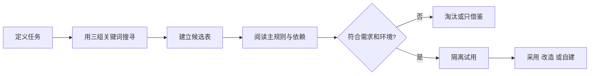

# 现成 Skill 搜寻与评估流程

## 目的

在自建前找到可借鉴方案，并按真实需求、内容、依赖及维护风险筛选，而不是按人气直接采用。

## 必要输入

- 要完成的任务、输入和交付物。
- 可接受的工具、资料及外部依赖。
- 团队使用环境和维护能力。

## 角色

- 需求负责人：确认候选是否解决真实问题。
- 技术审阅者：阅读规则、依赖和可执行内容。
- 使用者：以实际案例进行试用。

## 前置检查

- 不处理任何帐密或敏感设定。
- 搜寻阶段只读，不因找到候选便自动安装。

## 操作步骤

1. 用一句话定义任务，列出必要输入、预期输出及不能接受的行为。
2. 分别以任务名称、交付物名称和常用工具搜寻候选。
3. 记录来源、版本、更新时间、Star／下载量及作者说明，只把人气作排序讯号。
4. 阅读触发条件、主规则、引用资源、脚本、依赖和外部连接。
5. 以适配度、依赖成本、可读性和维护状态四项评分。
6. 对合格候选使用非敏感样本隔离试用，记录实际输出和变更。
7. 选择原样采用、局部改造、只借鉴结构或完全自建。
8. 保存来源版本、采用理由、修改点和回退方式。

## 决策分支

- 高人气但需求不符：淘汰，不为了使用而改变任务。
- 规则有价值但依赖不可用：只借鉴方法，重新实现必要部分。
- 内容无法读懂：不进团队环境。

## 产出物

- Skill 候选比较表。
- 试用记录。
- 采用／改造／自建决定。

## 验收标准

- 至少比较三个候选或记录没有合格候选。
- 已阅读实际规则和依赖，不只看介绍页。
- 候选以真实案例测试。
- 采用结果有版本及回退记录。

## 常见失败及修复

- 只按 Star 排名：增加真实输出和依赖评估。
- 找到第一个便使用：建立最少三个候选的对照。
- 忽略维护：记录更新时间和替代方案。

## 证据

- Video：`DJI_20260830105517_0002_D`
- 时间：`00:10:00–00:20:00`
- 状态：Cleaned Review；安全审阅及回退栏为实务补充。
