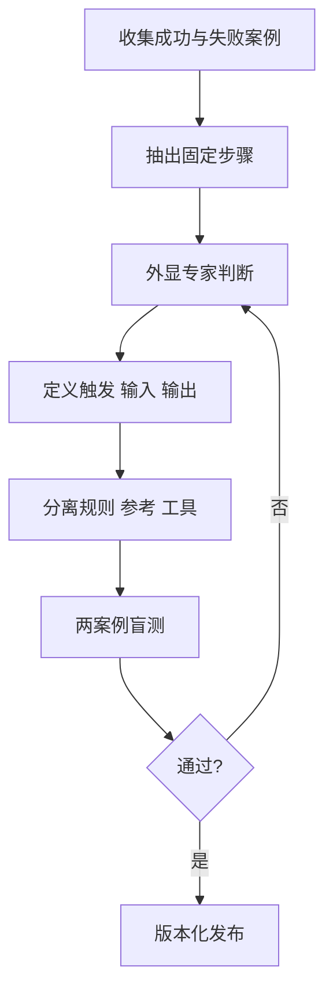

# 已验证工作封装成 Skill 流程

## 目的

把已重复成功的个人方法，转成别人或 Agent 能依规则执行、测试及维护的 Skill。

## 必要输入

- 至少两个不同成功案例和一个失败案例。
- 实际使用者、触发语句及交付物。
- 专家判断、例外和验收标准。

## 角色

- 方法拥有人：说明隐性判断。
- Skill 设计者：建立路由、规则和资源结构。
- 盲测使用者：不依赖原作者提示完成任务。

## 前置检查

- 工作方法已跑通，不把研究中的假设标成成熟规则。
- 成功不是偶然由隐藏 Context 或作者补救造成。

## 操作步骤

1. 收集两个不同成功案例及一个具代表性的失败案例。
2. 对照案例，抽出固定步骤、可变输入及只在特定条件出现的分支。
3. 访谈方法拥有人，记录选择、停止、升级和拒绝的判断。
4. 定义何时触发、必要输入、输出格式、验收及不适用情况。
5. 把核心路由、详细参考、范例及工具按责任分开。
6. 建立最小 Skill 版本，不加入尚未有案例支持的功能。
7. 由另一位使用者在干净 Context 跑两个案例，记录失败归因。
8. 修订并通过后，保存版本、变更记录和回退路径。

## 决策分支

- 成功案例做法不同：先找共同目标，再决定是否需要两条路由。
- 专家无法说出判断：用实际案例逐步追问「为什么这次不同」。
- 盲测需要原作者介入：把介入内容补成输入、规则或例外分支。

## 产出物

- Skill 规格。
- 主规则、参考及工具结构。
- 三案例证据和验收报告。

## 验收标准

- 触发、输入、输出及不适用情况清楚。
- 两个不同案例可由非作者完成。
- 失败可归因至明确层次。
- 版本和回退方式存在。

## 常见失败及修复

- 直接封装第一版 Prompt：先取得重复成功证据。
- 把所有知识塞进主文件：拆到按需参考。
- 只测理想案例：加入缺资料或例外案例。

## 证据

- Video：`DJI_20260830105517_0002_D`
- 时间：`00:20:00–00:27:43`
- 状态：Cleaned Review。
