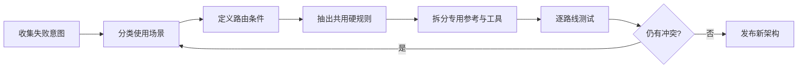

# Skill 顶层设计与规则拆分流程

## 目的

修复因用途混合、规则冲突或主文件过重而表现不稳定的 Skill。

## 必要输入

- 现有 Skill 规则及相关资源。
- 失败案例、错误路由和使用者意图。
- 各种交付物的验收标准。

## 角色

- 产品／业务负责人：定义不同使用意图。
- Skill 架构者：重画路由与责任边界。
- 测试者：对每条路线独立验证。

## 前置检查

- 保存目前版本和失败证据。
- 不在未理解冲突前继续添加补丁规则。

## 操作步骤

1. 列出所有实际使用意图、错误触发及交付物，不先看现有目录。
2. 把意图按「可以共用同一输入、流程及验收」分组。
3. 为每组写一条清楚路由条件和不应触发的反例。
4. 只在主层保留全局硬规则、路由顺序和完成边界。
5. 把场景知识、案例、模板和工具移到各自专用资源。
6. 检查同一概念是否在多处给出不同规则，指定唯一真源。
7. 对每条路线各测正常、边界和不应触发案例。
8. 比较旧版，确认没有因重构丢失必要能力，再版本化发布。

## 决策分支

- 两场景只差输出格式：可保留共用流程，以输出模板分支。
- 两场景资料或验收不同：拆成独立路由。
- 规则需要载入全部资料才能判断：先建立轻量索引或路由表。

## 产出物

- 意图及路由图。
- 共用硬规则与专用资源清单。
- 每条路线的测试报告。

## 验收标准

- 每个意图只进入一条预期路线。
- 主规则没有承载所有详细知识。
- 规则冲突有唯一真源。
- 重构前的必要能力没有回归。

## 常见失败及修复

- 按档案类型分而非按意图：回到使用者要完成的成果。
- 主文件仍引用全部内容：建立索引并按需载入。
- 只测正例：增加不应触发反例。

## 证据

- Video：`DJI_20260830112259_0003_D`
- 时间：`00:00:00–00:08:00`
- 状态：Cleaned Review；路由测试规格为整理后实作方法。
