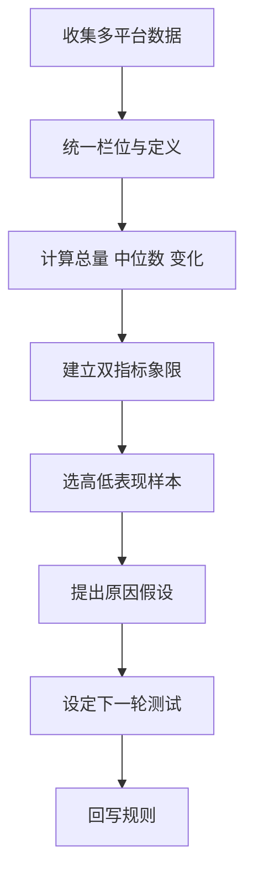

# 内容数据回流与自主复盘流程

## 目的

把多平台表现由分散报表转成可比较数据、原因假设及下一轮内容规则。

## 必要输入

- 各平台内容 ID、发布日期、题材及格式。
- 发布量、阅读／播放、互动、点击及业务结果。
- 上月基线及资料定义。

## 角色

- 数据整理者：确保定义一致和缺漏透明。
- 内容负责人：解释题材、创意及分发条件。
- 决策者：批准下一轮测试规则。

## 前置检查

- 不直接相加定义不同的平台指标。
- 标记付费投放、异常事件及资料缺漏。

## 操作步骤

1. 以内容 ID 对齐各平台发布和表现，保留原始数据来源。
2. 统一共通栏位，平台特有指标分开保存，不强行混合。
3. 计算发布量、总量、中位数、上月差异及内容分布。
4. 选两个具有不同业务意义的指标建立象限，例如互动和点击。
5. 从双高、单高、低表现各选代表内容，回看题材、标题、结构和分发。
6. 分开写数据事实及原因假设，每个假设附验证方法。
7. 选一至三条可测试改动放入下月，不一次改变全部策略。
8. 下月比较结果；有重复证据的学习才回写工作台规则。

## 决策分支

- 样本太少：只作观察，不建立永久规则。
- 指标受投放影响：分开自然和付费表现。
- 高互动但无业务结果：按内容目的判断，不把单一指标当成功。

## 产出物

- 月度内容数据表。
- 象限及代表样本。
- 原因假设、测试项和规则更新记录。

## 验收标准

- 指标定义和资料缺漏清楚。
- 总量、中位数及分布同时呈现。
- 原因假设没有冒充数据事实。
- 下一轮每项改动都有验证方法。

## 常见失败及修复

- 只看总阅读量：加入发布量和中位数。
- 用一篇爆款代表全部：检查分布和持续性。
- 复盘没有行动：每个结论必须对应下一轮测试或不采用理由。

## 证据

- Video：`DJI_20260830112259_0003_D`
- 时间：`00:12:00–00:17:00`
- 状态：Cleaned Review。
