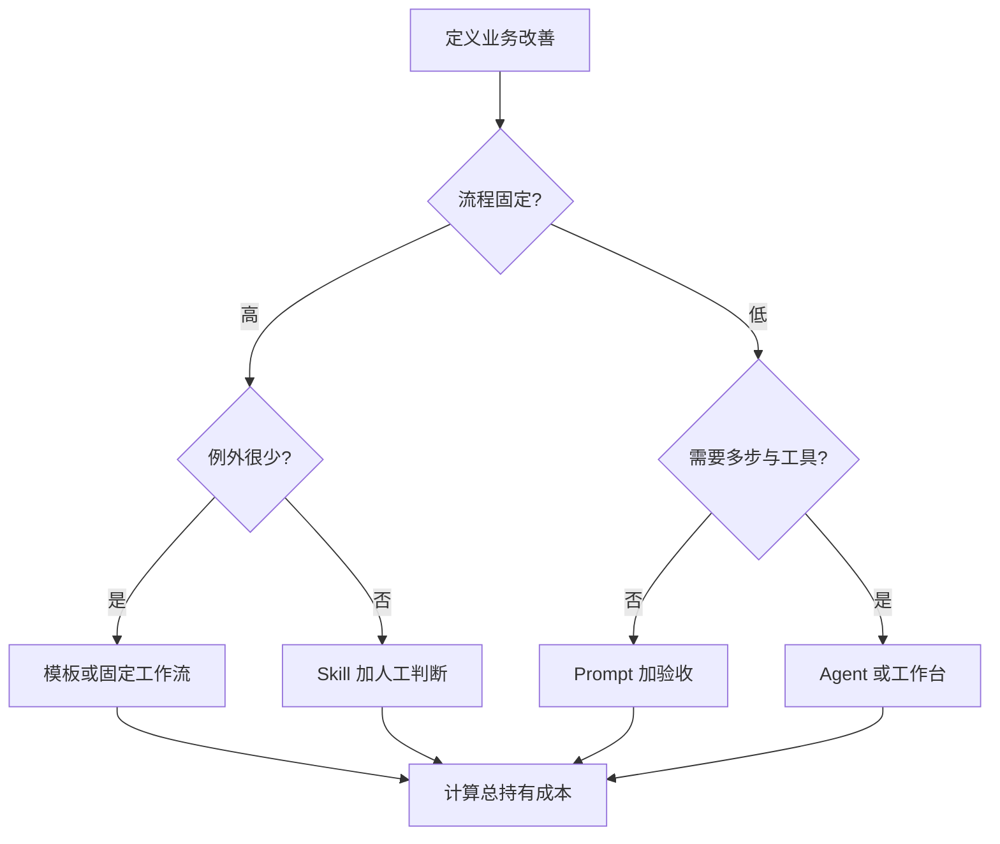

# 企业自动化方案选型流程

## 目的

按业务价值、变化程度、维护能力和总成本，选择 Prompt 模板、固定工作流、Agent／Skill 或工作台。

## 必要输入

- 现况流程、频率、工时、错误及业务价值。
- 规则变化程度、例外数量和资料条件。
- 建立及维护者能力。

## 角色

- 业务负责人：定义价值和风险。
- 建立者：估算技术依赖及维护成本。
- 使用者：验证入口和日常采用。

## 前置检查

- 先证明问题值得解决，不预设一定需要 AI。
- 保存原流程基线，包含时间、品质和失败率。

## 操作步骤

1. 写出要改善的角色、结果、基线及成功门槛。
2. 画现况流程，记录频率、变化、例外、资料和责任。
3. 规则固定且例外少，优先考虑模板或固定工作流。
4. 需要专家判断但可重用，考虑 Skill 加人工验收。
5. 需要多步推进、资料和工具，才考虑 Agent 或工作台。
6. 为每个方案列出帐号、接口、参数、监控、故障和负责人。
7. 计算首次建立、每月维护、失败恢复及使用培训成本。
8. 用最小场景试点，按业务结果而非功能数量选择方案。

## 决策分支

- 人工流程本身不清楚：先标准化，不立即自动化。
- 高价值但高风险：保留人工批准和回退。
- 维护者不足：选较简单方案或由 FDE 陪伴建立能力。

## 产出物

- 自动化选型表。
- 总持有成本估算。
- 试点方案及不采用理由。

## 验收标准

- 选择可连回具体业务改善。
- 已计算隐藏依赖及维护成本。
- 使用者能力与入口设计相符。
- 试点有基线、期限和停止条件。

## 常见失败及修复

- 按最新工具选型：回到流程变化和维护能力。
- 只数节点：展开每个节点的依赖和错误处理。
- 只看首次成本：加入每月维护及故障恢复。

## 证据

- Video：`DJI_20260830114141_0004_D`
- 时间：`00:00:00–00:10:00`
- 状态：Cleaned Review；选型矩阵为课堂观点的结构化应用。
