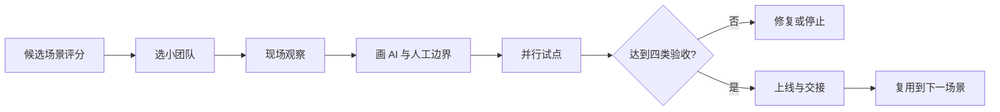

# FDE 低风险试点与陪伴式交付流程

## 目的

由高频、低复杂、成果可见的小团队场景开始，在不破坏核心业务的情况下建立 AI 采用、信心及内部能力。

## 必要输入

- 候选场景、现况流程及可量度基线。
- 小团队负责人、实际使用者及工程交付者。
- 资料、权限、风险及人工责任边界。

## 角色

- 业务赞助人：确认价值、范围和试点资源。
- FDE：观察现场、设计方案、工程交付及采用跟进。
- 使用者：提供真实案例、例外和回馈。
- 验收者：核对技术、业务、采用和维护证据。

## 前置检查

- 不直接改动不可中断的核心流程。
- 为原流程保留并行回退。
- 试点范围和成功门槛由业务负责人确认。

## 操作步骤

1. 以频率、复杂度、风险、资料可用性及成果可见度评分候选场景。
2. 选择有负责人、数人规模、不是核心中断点的小团队。
3. FDE 跟随真实工作，记录正式步骤、实际操作、例外和隐性判断。
4. 画出 AI 自动、人审、禁止自动化及例外升级四区。
5. 设计最小方案，保留原流程并行，定义两至四周试点期。
6. 建立可读回的技术、业务、采用和维护指标，每周共同复盘。
7. 达标后完成使用培训、维护文件、问题入口、负责人及回退演练。
8. 交接稳定后才选下一个相近场景，复用方法而不是原样复制工具。

## 决策分支

- 场景高频但资料差：先改善资料入口，不承诺自动化效果。
- 使用者不采用：回到现场观察，修复流程摩擦或价值假设。
- 试点未达标：停止或缩小，不因已投入便扩展。
- 核心业务需要改造：先取得更高级别的风险和变更批准。

## 产出物

- 场景评分及试点章程。
- 现况流程、AI／人工责任图及最小方案。
- 每周复盘、四类验收及交接包。

## 验收标准

- 技术：流程可运行、错误可见、原流程可回退。
- 业务：指定时间、品质或结果指标达到门槛。
- 采用：目标使用者能自行使用并愿意持续。
- 维护：内部负责人可处理常见问题及知道升级路径。

## 常见失败及修复

- 一开始做全公司核心流程：收缩至小团队和非中断点。
- 只交系统不陪使用：把采用、培训和复盘列入交付。
- 把工具上线当完成：以四类验收和交接读回判定。

## 证据

- Video：`DJI_20260830114141_0004_D`
- 时间：`00:08:00–00:15:12`
- 状态：Cleaned Review；评分和四类验收为课堂原则的结构化落地。
