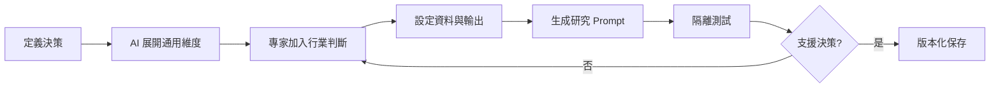

# 行業研究 Prompt 共創流程

## 目的

把「幫我研究某行業」轉成包含決策目的、行業判斷、資料要求及驗收標準的可重用 Prompt。

## 必要輸入

- 報告接收者及要做的決策。
- 行業、地區、時間範圍及公司位置。
- 已知資料、必查來源及不可接受來源。
- 三條由從業者提供的實務判斷。

## 角色

- 業務專家：提供行業權重、例外及決策語境。
- AI／Agent：擴展分析維度、整理 Prompt 及執行研究。
- 驗收者：判斷報告是否支援原決策。

## 前置檢查

- 先完成目標、對象、輸入、輸出、標準、邊界六欄。
- 把事實、假設及待查問題分開。

## 操作步驟

1. 用一句話寫清楚報告完成後，接收者要作哪項決定。
2. 要求 AI 提出產業基本面、價值鏈、競爭、需求、趨勢及風險等候選維度。
3. 由業務專家刪除低價值維度，加入政策、渠道、客群、指標及內部限制。
4. 為每個核心維度指定資料來源、時間範圍、信度及缺資料時的處理方式。
5. 固定交付結構，包括摘要、證據、分析、風險、建議及未知項。
6. 生成正式 Prompt，移到新窗口，以另一個相近細分類執行。
7. 對照決策需要，記錄遺漏、錯誤權重及沒有證據的結論。
8. 修訂後保存版本、案例及適用行業邊界。

## 決策分支

- 若業務專家無法補充判斷：先做探索研究，不把結果標成專家級報告。
- 若資料不足：交付未知項及補資料建議，不要求 Agent 補寫確定結論。
- 若換行業後失效：保留通用骨架，另外建立行業專用層。

## 產出物

- 六欄研究 Brief。
- 行業研究 Prompt v01 或以上。
- 測試輸出及差距記錄。

## 驗收標準

- 報告明確支援一項決策。
- 每個重要結論可連回來源。
- 至少加入三條人類行業判斷。
- 已在乾淨窗口和第二案例通過測試。

## 常見失敗及修復

- 維度很多但沒有優先級：由決策問題反推必讀章節。
- 報告像百科：加入公司位置、競爭選擇及行動門檻。
- AI 自行假設資料：強制標示缺口及信心水平。

## 證據

- Video：`DJI_20260830102734_0001_D`
- 時間：`00:02:00–00:18:30`
- 狀態：Cleaned Review；流程是依課堂方法整理的可執行版本。
