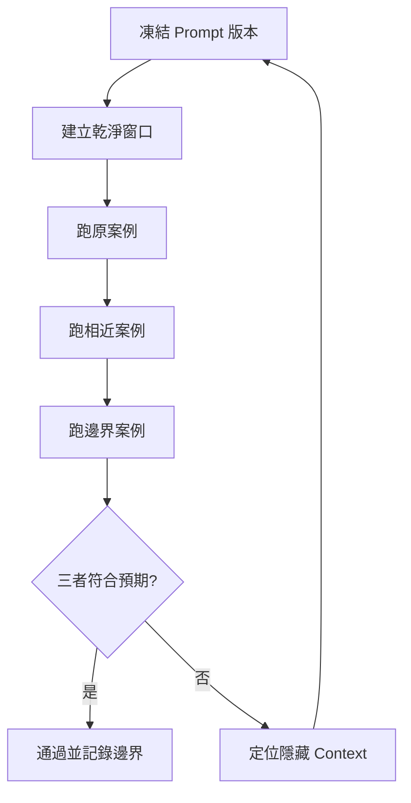

# Prompt 新窗口隔離測試流程

## 目的

證明 Prompt 不依賴作者原本對話中的隱藏背景，並能在第二個相近案例中重現合格結果。

## 必要輸入

- 待測 Prompt 及版本號。
- 原成功案例、相近案例及一個邊界案例。
- 可逐項判斷的驗收清單。

## 角色

- 設計者：提供 Prompt 和預期用途。
- 測試者：只使用正式輸入，不補充口頭背景。
- 驗收者：比較三個案例的結果。

## 前置檢查

- 關閉或離開原設計對話。
- 確認新窗口沒有載入舊項目資料。
- 固定模型和工具條件，避免同時改變多個變量。

## 操作步驟

1. 保存 Prompt、模型條件、工具及驗收表，形成不可混淆的測試版本。
2. 在乾淨窗口只貼入正式 Prompt 和原案例輸入，禁止補充設計對話內容。
3. 逐項核對輸出，記下 Prompt 沒有明寫但模型似乎猜中的內容。
4. 使用相近但不同資料的第二案例，檢查方法是否過度配合原案例。
5. 使用缺資料或接近適用邊界的案例，觀察能否停止、提問或標示未知。
6. 把失敗歸因為輸入缺漏、規則過窄、格式不清或隱藏 Context。
7. 只修改一類主要問題，建立下一版本並重跑失敗案例。

## 決策分支

- 原案例在新窗口失敗：Prompt 尚未自包含，先補必要背景。
- 第二案例失敗：把行業專用規則與通用骨架分離。
- 邊界案例仍自信作答：加入停止條件、缺資料處理及人工升級。

## 產出物

- 三案例測試記錄。
- 隱藏 Context 缺口清單。
- 通過或退回結論。

## 驗收標準

- 原案例在乾淨窗口重現合格結果。
- 第二案例達到同一核心驗收標準。
- 邊界案例不會把未知資料寫成事實。
- 測試者無需作者口頭補充。

## 常見失敗及修復

- 測試者知道答案並主動補充：改由另一位同事盲測。
- 模型版本不同造成差異：記錄環境並分開比較。
- 只看成品感覺：把驗收改成可逐項勾選。

## 證據

- Video：`DJI_20260830102734_0001_D`
- 時間：`00:18:00–00:22:00`
- 狀態：Cleaned Review。
