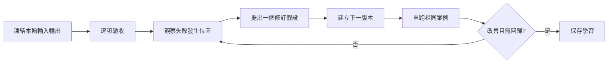

# Prompt 結果復盤與版本升級流程

## 目的

把「這次不好」轉成可追溯的差距、最小修改及下一版本，避免無方向地反覆重寫。

## 必要輸入

- Prompt 版本、正式輸入及完整輸出。
- 任務驗收標準。
- 中途工具及步驟記錄。

## 角色

- 執行者：保存輸入輸出和中途觀察。
- 業務驗收者：指出結果對實際工作是否有用。
- 維護者：決定哪些學習升級為共用規則。

## 前置檢查

- 先分辨事實錯誤、方法缺漏、格式問題及偏好差異。
- 每一輪只選一個主要假設進行修改。

## 操作步驟

1. 保存本輪 Prompt、輸入、輸出、模型條件及完成時間。
2. 用驗收表標出通過、失敗、未能判斷及超出範圍項目。
3. 回看 Agent 中途行為，定位偏差由哪一步開始。
4. 將主要原因標記為目標、流程、格式、背景、工具或輸入。
5. 寫出一條修訂假設，例如「加入來源優先級可減少無證據結論」。
6. 只修改相關規則，版本號加一，使用相同輸入重跑。
7. 比較新舊結果，確認改善沒有破壞原本通過項。
8. 經兩個案例驗證後，才把學習加入共用 Prompt 或 Skill。

## 決策分支

- 結果改善但成本大增：按業務價值決定是否接受。
- 一個案例改善、另一案例變差：將規則改為條件分支。
- 問題來自工具：不要用 Prompt 補救，轉到工具或資料層修復。

## 產出物

- Prompt 版本紀錄。
- 差距和失敗歸因。
- 新舊輸出對照及升級決定。

## 驗收標準

- 每次版本只改變有清楚理由的規則。
- 新版本改善指定失敗，沒有破壞既有通過項。
- 升級規則至少通過兩個案例。
- 可由第三者重現測試。

## 常見失敗及修復

- 只寫「效果不好」：改成對應具體驗收項。
- 每輪整份重寫：保留基準並做最小差異。
- 只看最終輸出：回看工具和中間步驟。

## 證據

- Video：`DJI_20260830102734_0001_D`
- 時間：`00:08:00–00:27:42`
- 狀態：Cleaned Review；版本控制細節為整理後操作規格。
