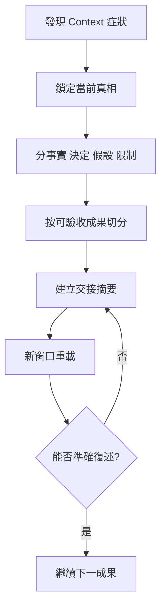

# Context 超載診斷與任務切分流程

## 目的

當 Agent 開始忘記約束、混合舊任務或反覆失準時，安全地把工作切成新窗口可延續的成果單元。

## 必要輸入

- 當前任務目標、來源、規則及完成狀態。
- 已確認決定、尚未確認假設及未完成項。
- 最近一次合格輸出。

## 角色

- 任務負責人：確認哪些資訊不可遺失。
- Agent：協助整理，但不能自行把推測升級為決定。
- 下一階段執行者：只依交接包重新開始。

## 前置檢查

- 排除工具故障、權限或輸入檔案問題。
- 確認症狀是遺忘、混線、重複或規則衝突。

## 操作步驟

1. 暫停新增要求，列出目前模型忘記或混淆的具體證據。
2. 以權威文件和已驗收成果重建當前事實，不直接信任長對話摘要。
3. 分開寫出目標、來源、規則、決定、假設、已完成及未完成。
4. 把剩餘工作按可獨立驗收的交付物切分，不按字數平均分段。
5. 為下一交付物建立一頁交接摘要及必要檔案路徑。
6. 在新窗口只載入交接摘要和當前交付物需要的來源。
7. 先要求 Agent 復述任務、限制和完成標準，再開始執行。
8. 完成後把結果和新決定回填主狀態，不把整段新對話全部搬回。

## 決策分支

- 無法確認當前真相：停止執行，先由負責人裁決衝突來源。
- 任務不能切分：縮小輸入，只保留支持當前一個判斷的資料。
- 新窗口仍失準：問題可能在規格而非 Context，轉入四層排錯。

## 產出物

- Context 診斷記錄。
- 一頁交接摘要。
- 分階段交付物清單。

## 驗收標準

- 新窗口可準確復述目標、來源及限制。
- 沒有把假設寫成已確認決定。
- 每個剩餘階段都有獨立完成標準。
- 下一位執行者不需要閱讀整段舊對話。

## 常見失敗及修復

- 摘要過長：只保留與下一成果有關的狀態。
- 摘要過短：補上權威來源、禁止事項和驗收。
- 開了新窗口仍帶入全部歷史：改用最小 Context 包。

## 證據

- Video：`DJI_20260830105517_0002_D`
- 時間：`00:00:00–00:02:00`
- 狀態：Cleaned Review；交接欄位為整理後實作方法。
