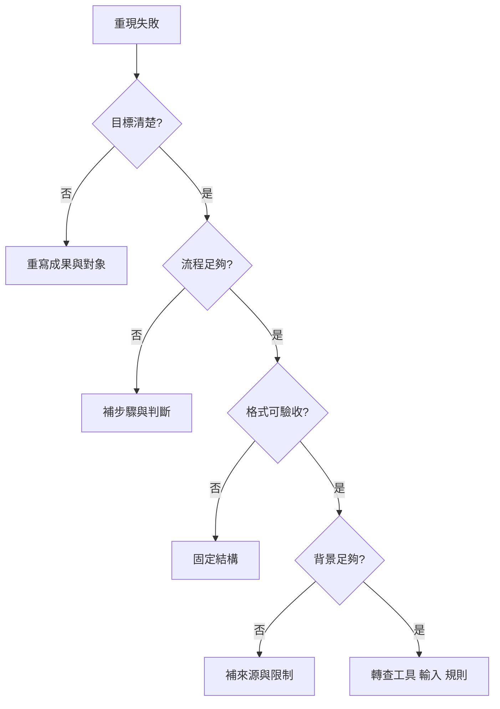

# Prompt 四層排錯流程

## 目的

用固定順序把答非所問或品質不穩定的問題，定位至目標、流程、格式、背景或非 Prompt 系統層。

## 必要輸入

- 原 Prompt、輸入、輸出及預期結果。
- 可重現的失敗案例。
- 模型、工具和資料狀態。

## 角色

- 業務驗收者：指出哪項結果不能用。
- Prompt 維護者：逐層提出和測試修訂。
- 工具負責人：接手非 Prompt 故障。

## 前置檢查

- 用同一輸入重現失敗。
- 確認不是服務中斷、檔案不可讀或權限問題。

## 操作步驟

1. 把失敗描述成「預期 X，實際 Y」，不要只寫效果差。
2. 檢查目標層：成果、使用者、決策及成功條件是否明確。
3. 檢查流程層：是否提供研究、比較、判斷、驗證及停止步驟。
4. 檢查格式層：輸出結構、長度、欄位及引用要求是否可逐項驗收。
5. 檢查背景層：資料、術語、案例、限制及優先級是否足夠。
6. 若四層均完整，轉查 Context、輸入品質、工具能力、權限及規則衝突。
7. 只修正首個主要缺口，保留其他條件不變並重跑。
8. 記錄根因和結果；通過第二案例後才升級共用版本。

## 決策分支

- 多層同時缺失：先目標，再流程、格式、背景。
- 失敗不能穩定重現：先收集更多案例，不立即修改共用 Prompt。
- 工具無能力完成：更換執行路徑或縮小成果，不用語句掩蓋能力缺口。

## 產出物

- 四層診斷表。
- 單一根因假設。
- 修訂版本及新舊比較。

## 驗收標準

- 失敗可在固定案例重現。
- 修訂只針對一個主要層次。
- 新結果改善指定問題。
- 非 Prompt 問題已轉交正確負責層。

## 常見失敗及修復

- 只增加更多字：改為補一個可驗收缺口。
- 用格式解決資料不足：先補可靠來源。
- 把模型能力問題當語氣問題：明確回報能力邊界。

## 證據

- Video：`DJI_20260830105517_0002_D`
- 時間：`00:02:00–00:08:00`
- 狀態：Cleaned Review。
