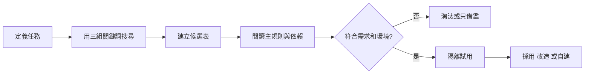

# 現成 Skill 搜尋與評估流程

## 目的

在自建前找到可借鑑方案，並按真實需求、內容、依賴及維護風險篩選，而不是按人氣直接採用。

## 必要輸入

- 要完成的任務、輸入和交付物。
- 可接受的工具、資料及外部依賴。
- 團隊使用環境和維護能力。

## 角色

- 需求負責人：確認候選是否解決真實問題。
- 技術審閱者：閱讀規則、依賴和可執行內容。
- 使用者：以實際案例進行試用。

## 前置檢查

- 不處理任何帳密或敏感設定。
- 搜尋階段只讀，不因找到候選便自動安裝。

## 操作步驟

1. 用一句話定義任務，列出必要輸入、預期輸出及不能接受的行為。
2. 分別以任務名稱、交付物名稱和常用工具搜尋候選。
3. 記錄來源、版本、更新時間、Star／下載量及作者說明，只把人氣作排序訊號。
4. 閱讀觸發條件、主規則、引用資源、腳本、依賴和外部連接。
5. 以適配度、依賴成本、可讀性和維護狀態四項評分。
6. 對合格候選使用非敏感樣本隔離試用，記錄實際輸出和變更。
7. 選擇原樣採用、局部改造、只借鑑結構或完全自建。
8. 保存來源版本、採用理由、修改點和回退方式。

## 決策分支

- 高人氣但需求不符：淘汰，不為了使用而改變任務。
- 規則有價值但依賴不可用：只借鑑方法，重新實現必要部分。
- 內容無法讀懂：不進團隊環境。

## 產出物

- Skill 候選比較表。
- 試用記錄。
- 採用／改造／自建決定。

## 驗收標準

- 至少比較三個候選或記錄沒有合格候選。
- 已閱讀實際規則和依賴，不只看介紹頁。
- 候選以真實案例測試。
- 採用結果有版本及回退記錄。

## 常見失敗及修復

- 只按 Star 排名：增加真實輸出和依賴評估。
- 找到第一個便使用：建立最少三個候選的對照。
- 忽略維護：記錄更新時間和替代方案。

## 證據

- Video：`DJI_20260830105517_0002_D`
- 時間：`00:10:00–00:20:00`
- 狀態：Cleaned Review；安全審閱及回退欄為實務補充。
