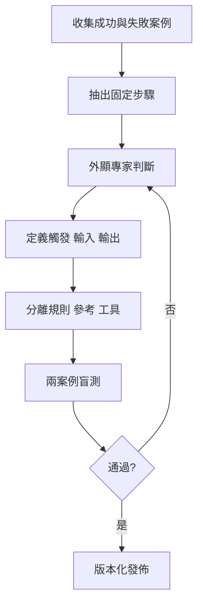

# 已驗證工作封裝成 Skill 流程

## 目的

把已重複成功的個人方法，轉成別人或 Agent 能依規則執行、測試及維護的 Skill。

## 必要輸入

- 至少兩個不同成功案例和一個失敗案例。
- 實際使用者、觸發語句及交付物。
- 專家判斷、例外和驗收標準。

## 角色

- 方法擁有人：說明隱性判斷。
- Skill 設計者：建立路由、規則和資源結構。
- 盲測使用者：不依賴原作者提示完成任務。

## 前置檢查

- 工作方法已跑通，不把研究中的假設標成成熟規則。
- 成功不是偶然由隱藏 Context 或作者補救造成。

## 操作步驟

1. 收集兩個不同成功案例及一個具代表性的失敗案例。
2. 對照案例，抽出固定步驟、可變輸入及只在特定條件出現的分支。
3. 訪談方法擁有人，記錄選擇、停止、升級和拒絕的判斷。
4. 定義何時觸發、必要輸入、輸出格式、驗收及不適用情況。
5. 把核心路由、詳細參考、範例及工具按責任分開。
6. 建立最小 Skill 版本，不加入尚未有案例支持的功能。
7. 由另一位使用者在乾淨 Context 跑兩個案例，記錄失敗歸因。
8. 修訂並通過後，保存版本、變更記錄和回退路徑。

## 決策分支

- 成功案例做法不同：先找共同目標，再決定是否需要兩條路由。
- 專家無法說出判斷：用實際案例逐步追問「為甚麼這次不同」。
- 盲測需要原作者介入：把介入內容補成輸入、規則或例外分支。

## 產出物

- Skill 規格。
- 主規則、參考及工具結構。
- 三案例證據和驗收報告。

## 驗收標準

- 觸發、輸入、輸出及不適用情況清楚。
- 兩個不同案例可由非作者完成。
- 失敗可歸因至明確層次。
- 版本和回退方式存在。

## 常見失敗及修復

- 直接封裝第一版 Prompt：先取得重複成功證據。
- 把所有知識塞進主文件：拆到按需參考。
- 只測理想案例：加入缺資料或例外案例。

## 證據

- Video：`DJI_20260830105517_0002_D`
- 時間：`00:20:00–00:27:43`
- 狀態：Cleaned Review。
