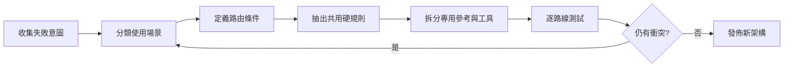

# Skill 頂層設計與規則拆分流程

## 目的

修復因用途混合、規則衝突或主文件過重而表現不穩定的 Skill。

## 必要輸入

- 現有 Skill 規則及相關資源。
- 失敗案例、錯誤路由和使用者意圖。
- 各種交付物的驗收標準。

## 角色

- 產品／業務負責人：定義不同使用意圖。
- Skill 架構者：重畫路由與責任邊界。
- 測試者：對每條路線獨立驗證。

## 前置檢查

- 保存目前版本和失敗證據。
- 不在未理解衝突前繼續添加補丁規則。

## 操作步驟

1. 列出所有實際使用意圖、錯誤觸發及交付物，不先看現有目錄。
2. 把意圖按「可以共用同一輸入、流程及驗收」分組。
3. 為每組寫一條清楚路由條件和不應觸發的反例。
4. 只在主層保留全局硬規則、路由順序和完成邊界。
5. 把場景知識、案例、模板和工具移到各自專用資源。
6. 檢查同一概念是否在多處給出不同規則，指定唯一真源。
7. 對每條路線各測正常、邊界和不應觸發案例。
8. 比較舊版，確認沒有因重構丟失必要能力，再版本化發佈。

## 決策分支

- 兩場景只差輸出格式：可保留共用流程，以輸出模板分支。
- 兩場景資料或驗收不同：拆成獨立路由。
- 規則需要載入全部資料才能判斷：先建立輕量索引或路由表。

## 產出物

- 意圖及路由圖。
- 共用硬規則與專用資源清單。
- 每條路線的測試報告。

## 驗收標準

- 每個意圖只進入一條預期路線。
- 主規則沒有承載所有詳細知識。
- 規則衝突有唯一真源。
- 重構前的必要能力沒有回歸。

## 常見失敗及修復

- 按檔案類型分而非按意圖：回到使用者要完成的成果。
- 主文件仍引用全部內容：建立索引並按需載入。
- 只測正例：增加不應觸發反例。

## 證據

- Video：`DJI_20260830112259_0003_D`
- 時間：`00:00:00–00:08:00`
- 狀態：Cleaned Review；路由測試規格為整理後實作方法。
