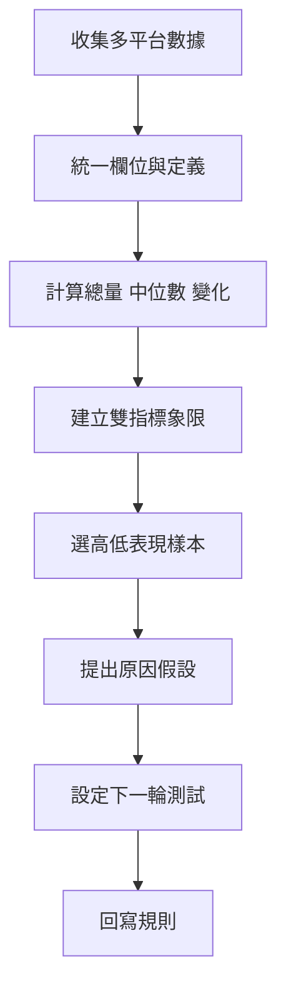

# 內容數據回流與自主復盤流程

## 目的

把多平台表現由分散報表轉成可比較數據、原因假設及下一輪內容規則。

## 必要輸入

- 各平台內容 ID、發佈日期、題材及格式。
- 發佈量、閱讀／播放、互動、點擊及業務結果。
- 上月基線及資料定義。

## 角色

- 數據整理者：確保定義一致和缺漏透明。
- 內容負責人：解釋題材、創意及分發條件。
- 決策者：批准下一輪測試規則。

## 前置檢查

- 不直接相加定義不同的平台指標。
- 標記付費投放、異常事件及資料缺漏。

## 操作步驟

1. 以內容 ID 對齊各平台發佈和表現，保留原始數據來源。
2. 統一共通欄位，平台特有指標分開保存，不強行混合。
3. 計算發佈量、總量、中位數、上月差異及內容分布。
4. 選兩個具有不同業務意義的指標建立象限，例如互動和點擊。
5. 從雙高、單高、低表現各選代表內容，回看題材、標題、結構和分發。
6. 分開寫數據事實及原因假設，每個假設附驗證方法。
7. 選一至三條可測試改動放入下月，不一次改變全部策略。
8. 下月比較結果；有重複證據的學習才回寫工作台規則。

## 決策分支

- 樣本太少：只作觀察，不建立永久規則。
- 指標受投放影響：分開自然和付費表現。
- 高互動但無業務結果：按內容目的判斷，不把單一指標當成功。

## 產出物

- 月度內容數據表。
- 象限及代表樣本。
- 原因假設、測試項和規則更新記錄。

## 驗收標準

- 指標定義和資料缺漏清楚。
- 總量、中位數及分布同時呈現。
- 原因假設沒有冒充數據事實。
- 下一輪每項改動都有驗證方法。

## 常見失敗及修復

- 只看總閱讀量：加入發佈量和中位數。
- 用一篇爆款代表全部：檢查分布和持續性。
- 復盤沒有行動：每個結論必須對應下一輪測試或不採用理由。

## 證據

- Video：`DJI_20260830112259_0003_D`
- 時間：`00:12:00–00:17:00`
- 狀態：Cleaned Review。
