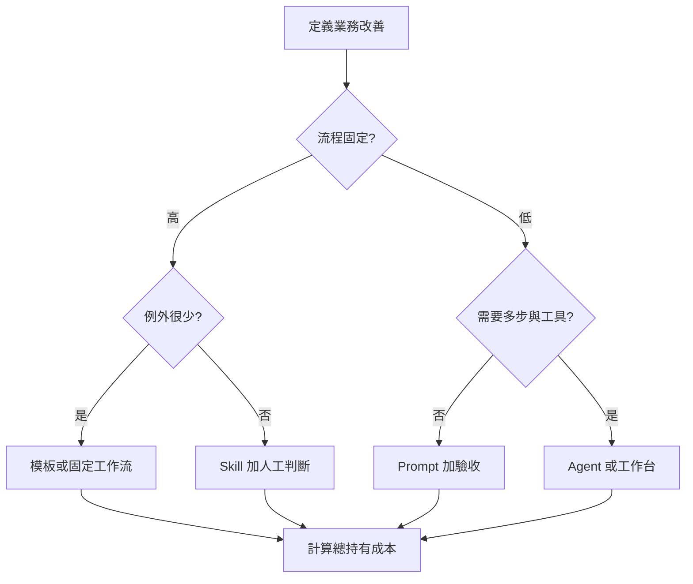

# 企業自動化方案選型流程

## 目的

按業務價值、變化程度、維護能力和總成本，選擇 Prompt 模板、固定工作流、Agent／Skill 或工作台。

## 必要輸入

- 現況流程、頻率、工時、錯誤及業務價值。
- 規則變化程度、例外數量和資料條件。
- 建立及維護者能力。

## 角色

- 業務負責人：定義價值和風險。
- 建立者：估算技術依賴及維護成本。
- 使用者：驗證入口和日常採用。

## 前置檢查

- 先證明問題值得解決，不預設一定需要 AI。
- 保存原流程基線，包含時間、品質和失敗率。

## 操作步驟

1. 寫出要改善的角色、結果、基線及成功門檻。
2. 畫現況流程，記錄頻率、變化、例外、資料和責任。
3. 規則固定且例外少，優先考慮模板或固定工作流。
4. 需要專家判斷但可重用，考慮 Skill 加人工驗收。
5. 需要多步推進、資料和工具，才考慮 Agent 或工作台。
6. 為每個方案列出帳號、接口、參數、監控、故障和負責人。
7. 計算首次建立、每月維護、失敗恢復及使用培訓成本。
8. 用最小場景試點，按業務結果而非功能數量選擇方案。

## 決策分支

- 人工流程本身不清楚：先標準化，不立即自動化。
- 高價值但高風險：保留人工批准和回退。
- 維護者不足：選較簡單方案或由 FDE 陪伴建立能力。

## 產出物

- 自動化選型表。
- 總持有成本估算。
- 試點方案及不採用理由。

## 驗收標準

- 選擇可連回具體業務改善。
- 已計算隱藏依賴及維護成本。
- 使用者能力與入口設計相符。
- 試點有基線、期限和停止條件。

## 常見失敗及修復

- 按最新工具選型：回到流程變化和維護能力。
- 只數節點：展開每個節點的依賴和錯誤處理。
- 只看首次成本：加入每月維護及故障恢復。

## 證據

- Video：`DJI_20260830114141_0004_D`
- 時間：`00:00:00–00:10:00`
- 狀態：Cleaned Review；選型矩陣為課堂觀點的結構化應用。
