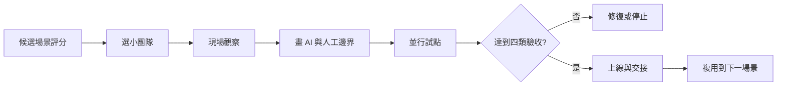

# FDE 低風險試點與陪伴式交付流程

## 目的

由高頻、低複雜、成果可見的小團隊場景開始，在不破壞核心業務的情況下建立 AI 採用、信心及內部能力。

## 必要輸入

- 候選場景、現況流程及可量度基線。
- 小團隊負責人、實際使用者及工程交付者。
- 資料、權限、風險及人工責任邊界。

## 角色

- 業務贊助人：確認價值、範圍和試點資源。
- FDE：觀察現場、設計方案、工程交付及採用跟進。
- 使用者：提供真實案例、例外和回饋。
- 驗收者：核對技術、業務、採用和維護證據。

## 前置檢查

- 不直接改動不可中斷的核心流程。
- 為原流程保留並行回退。
- 試點範圍和成功門檻由業務負責人確認。

## 操作步驟

1. 以頻率、複雜度、風險、資料可用性及成果可見度評分候選場景。
2. 選擇有負責人、數人規模、不是核心中斷點的小團隊。
3. FDE 跟隨真實工作，記錄正式步驟、實際操作、例外和隱性判斷。
4. 畫出 AI 自動、人審、禁止自動化及例外升級四區。
5. 設計最小方案，保留原流程並行，定義兩至四週試點期。
6. 建立可讀回的技術、業務、採用和維護指標，每週共同復盤。
7. 達標後完成使用培訓、維護文件、問題入口、負責人及回退演練。
8. 交接穩定後才選下一個相近場景，復用方法而不是原樣複製工具。

## 決策分支

- 場景高頻但資料差：先改善資料入口，不承諾自動化效果。
- 使用者不採用：回到現場觀察，修復流程摩擦或價值假設。
- 試點未達標：停止或縮小，不因已投入便擴展。
- 核心業務需要改造：先取得更高級別的風險和變更批准。

## 產出物

- 場景評分及試點章程。
- 現況流程、AI／人工責任圖及最小方案。
- 每週復盤、四類驗收及交接包。

## 驗收標準

- 技術：流程可運行、錯誤可見、原流程可回退。
- 業務：指定時間、品質或結果指標達到門檻。
- 採用：目標使用者能自行使用並願意持續。
- 維護：內部負責人可處理常見問題及知道升級路徑。

## 常見失敗及修復

- 一開始做全公司核心流程：收縮至小團隊和非中斷點。
- 只交系統不陪使用：把採用、培訓和復盤列入交付。
- 把工具上線當完成：以四類驗收和交接讀回判定。

## 證據

- Video：`DJI_20260830114141_0004_D`
- 時間：`00:08:00–00:15:12`
- 狀態：Cleaned Review；評分和四類驗收為課堂原則的結構化落地。
